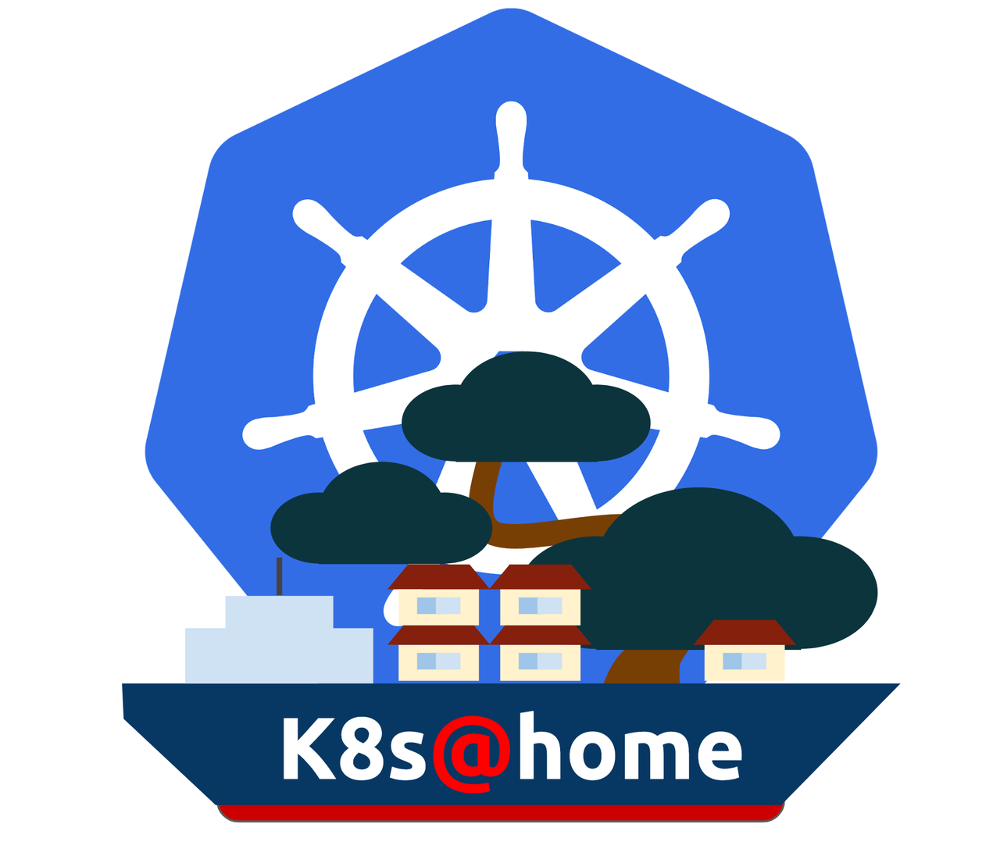

<!-- markdownlint-disable no-trailing-punctuation -->

### My home-lab repository :rocket:

✨*managed with k0s/Talos, ArgoCD, Renovate and GitHub*✨

---

**INFRASTRUCTURE K0S**

**TOOLING**

---

**INFRASTRUCTURE TALOS**

**TOOLING**

---

---

# Overview

This is my mono repo for my home infrastructure. It's based loosely on the ideas from [szinn/k8s-homelab](https://github.com/szinn/k8s-homelab) as well as various templates and resources from GitHub and Reddit.

It follows the concept of **Infrastructure as Code** and [**GitOps**](https://opengitops.dev/), leveraging tools such as ArgoCD, Renovate, and go-task to create an easily bootstrappable and manageable home lab environment, with a strong focus on automation for Day 1/Day 2 operations.

The motivation behind setting up this home lab was to refactor my original environment, which was primarily based on a Raspberry Pi 4 running Docker Compose. While this setup worked, it lacked scalability, automation, and was not GitOps-friendly. To address these limitations, I decided to migrate to a fully Kubernetes-based infrastructure, leveraging its rich and advanced ecosystem. This transition allows for better workload orchestration, improved automation through GitOps practices, and seamless integration with cloud-native tools, making the entire environment more maintainable, resilient, and future-proof.

The entire infrastructure is fully virtualized on **Proxmox**, where each server runs as a virtual machine within the Proxmox cluster. This setup provides flexibility, isolation, and ease of management while allowing efficient resource allocation.

# Kubernetes

To experiment with different Kubernetes distributions, I use a mix of **k0s** and **Talos**. Each of these distributions offers unique advantages and match different requirements of my environment.

- A cluster running k0s, intended for a lab environment running on the BeeLink hardware
- Another cluster running Talos, used for a production environment running on the GenMachine hardware.

The choice of k0s for the lab cluster is due to its suitability for hardware with limited resources. In this case, k0s has been configured with a minimal setup and a low footprint.
On the other hand, Talos is used for the production cluster, allowing me to take advantage of advanced features and capabilities.

# GitOps

ArgoCD watches both clusters, leveraging `ApplicationSet` CRDs to centralize management in the main cluster.

Renovate monitors my entire repository for dependency updates. When updates are found, a PR is automatically created and sometimes merged automatically. Once PRs are merged, ArgoCD applies the changes to my clusters.

The security aspect of GitOps is managed using **HC Vault** as a secret manager and **External Secrets** for synchronization to prevent pushing sensitive information into Git.
