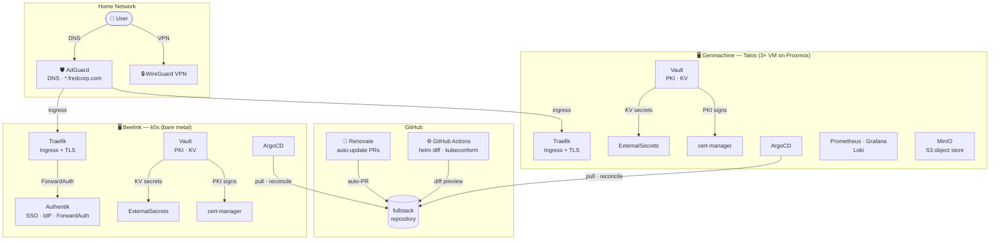
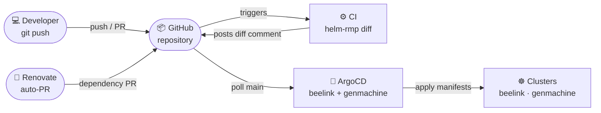

# ixxeL-DevOps HomeLab

_Infrastructure as Code · GitOps · Self-hosted · Fully automated_

**BEELINK — k0s**

**GENMACHINE — Talos**

---

---

## Overview

This repository is the single source of truth for a homelab running on two Kubernetes clusters, following **GitOps** and **Infrastructure as Code** principles. Every component — cluster bootstrap, application configuration, secret management, and certificate lifecycle — is declared as code and reconciled automatically.

The infrastructure evolved from a Raspberry Pi running Docker Compose into a production-grade Kubernetes platform. The two clusters are complementary: **Beelink** (k0s, bare metal) hosts the security and access infrastructure, while **Genmachine** (Talos Linux, Proxmox VMs) runs production workloads and the observability stack.

## Architecture

```mermaid
graph TB
    subgraph GH["GitHub"]
        repo[("fullstack\nrepository")]
        renovate["🤖 Renovate\nauto-update PRs"]
        ci["⚙️ GitHub Actions\nhelm diff · kubeconform"]
    end

    subgraph NET["Home Network"]
        user(["👤 User"])
        adguard["🛡️ AdGuard\nDNS · *.fredcorp.com"]
        vpn["🔒 WireGuard VPN"]
    end

    subgraph BK["🖥️ Beelink — k0s (bare metal)"]
        traefik_b["Traefik\nIngress + TLS"]
        authentik["Authentik\nSSO · IdP · ForwardAuth"]
        vault_b["Vault\nPKI · KV"]
        eso_b["ExternalSecrets"]
        certmgr_b["cert-manager"]
        argocd_b["ArgoCD"]
    end

    subgraph GM["🖥️ Genmachine — Talos (3× VM on Proxmox)"]
        traefik_g["Traefik\nIngress + TLS"]
        vault_g["Vault\nPKI · KV"]
        eso_g["ExternalSecrets"]
        certmgr_g["cert-manager"]
        argocd_g["ArgoCD"]
        prometheus["Prometheus · Grafana\nLoki"]
        minio["MinIO\nS3 object store"]
    end

    user -- "DNS" --> adguard
    user -- "VPN" --> vpn
    adguard -- "ingress" --> traefik_b & traefik_g
    traefik_b -- "ForwardAuth" --> authentik

    renovate -- "auto-PR" --> repo
    ci -- "diff preview" --> repo
    argocd_b & argocd_g -- "pull · reconcile" --> repo

    vault_b -- "PKI signs" --> certmgr_b
    vault_g -- "PKI signs" --> certmgr_g
    vault_b -- "KV secrets" --> eso_b
    vault_g -- "KV secrets" --> eso_g
```

## GitOps Flow

```mermaid
flowchart LR
    dev(["💻 Developer\ngit push"])
    bot(["🤖 Renovate\nauto-PR"])
    repo(["📦 GitHub\nrepository"])
    ci["⚙️ CI\nhelm-rmp diff"]
    argocd["🔄 ArgoCD\nbeelink + genmachine"]
    clusters["☸️ Clusters\nbeelink · genmachine"]

    dev -->|push / PR| repo
    bot -->|dependency PR| repo
    repo -->|triggers| ci
    repo -->|poll main| argocd
    argocd -->|apply manifests| clusters
    ci -->|posts diff comment| repo
```

## Stack

| Layer | Tool | Role |
|---|---|---|
| Cluster | Talos Linux + k0s | Immutable OS (Genmachine) · lightweight K8s (Beelink) |
| GitOps | ArgoCD + Renovate | Continuous reconciliation · automated dependency updates |
| Networking | Cilium + Traefik | eBPF CNI · L2 LB announcements · TLS ingress |
| DNS | AdGuard Home | Local resolver · `*.fredcorp.com` split-horizon |
| PKI / Secrets | HashiCorp Vault | CA · KV secrets · SOPS transit encryption |
| Certificates | cert-manager + trust-manager | Automated TLS lifecycle from Vault PKI |
| Secret sync | ExternalSecrets | Vault → Kubernetes Secret synchronisation |
| Auth | Authentik | SSO IdP · OIDC provider · ForwardAuth outpost |
| VPN | WireGuard Portal | Self-hosted VPN management |
| Observability | Prometheus · Grafana · Loki | Metrics · dashboards · logs |
| Storage | MinIO · Proxmox CSI | S3 object store · block volumes |
| Encryption | SOPS | Secrets encrypted at rest in Git |

## Documentation

Full documentation is available at the [project docs site](https://ixxel-devops.github.io/fullstack).
