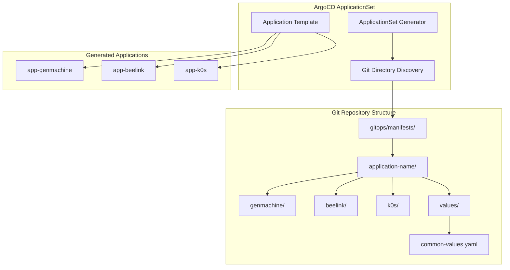
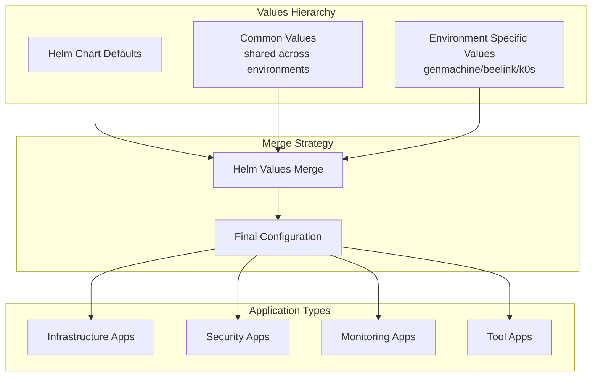
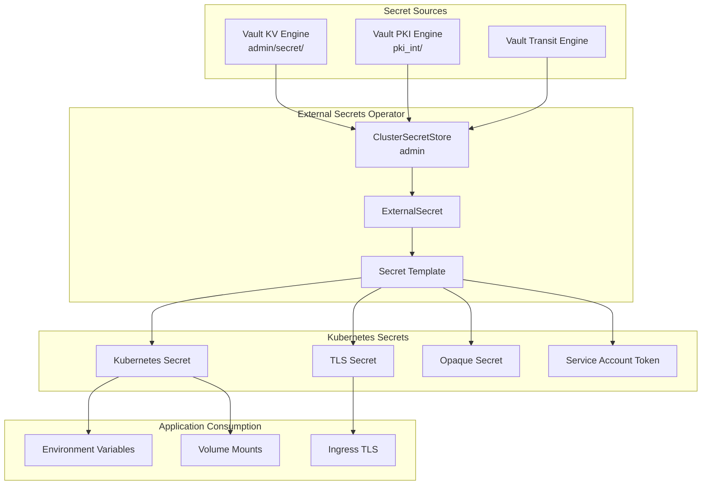
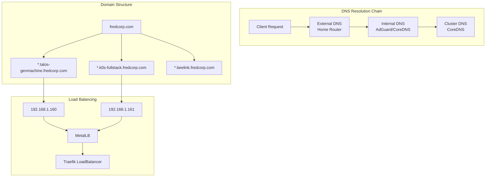
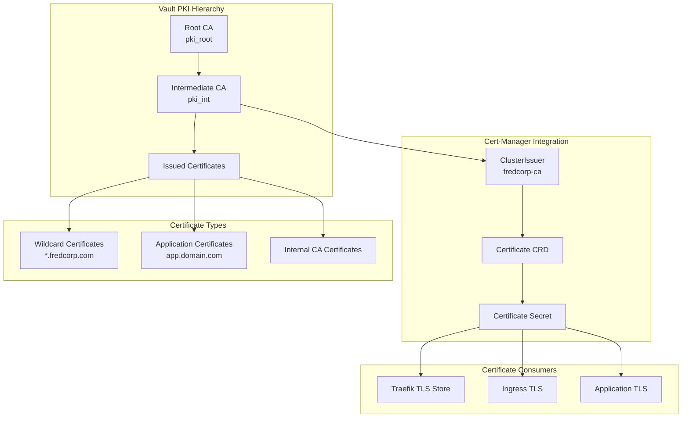
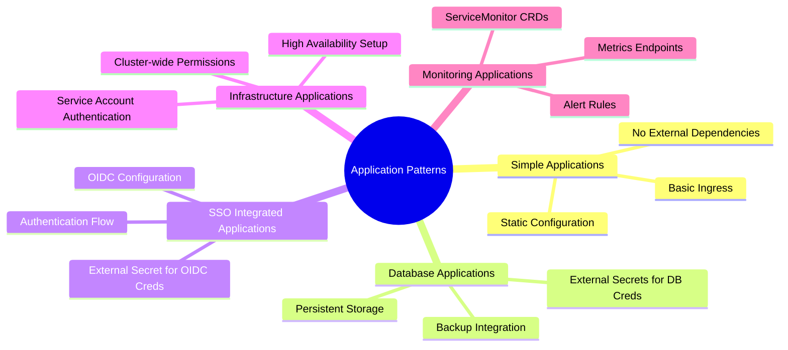
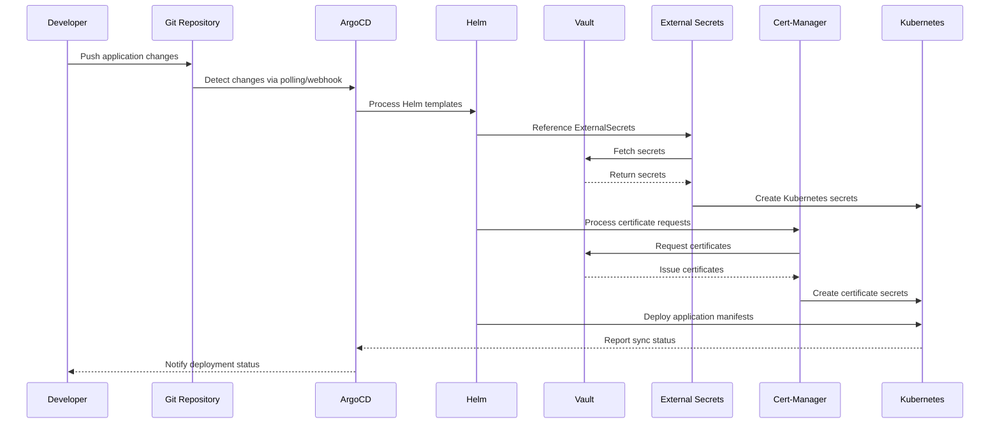

# ArgoCD Application Deployment Patterns - Complete Guide

## 📋 Table of Contents

1. [Overview](#overview)
2. [ArgoCD Application Architecture](#argocd-application-architecture)
3. [Helm Values Strategy](#helm-values-strategy)
4. [Secret Management](#secret-management)
5. [DNS and Ingress Configuration](#dns-and-ingress-configuration)
6. [Certificate Management](#certificate-management)
7. [Application Deployment Patterns](#application-deployment-patterns)
8. [Complete Application Examples](#complete-application-examples)
9. [Best Practices](#best-practices)
10. [Troubleshooting](#troubleshooting)

---

## 🎯 Overview

This guide provides an in-depth analysis of how applications are deployed in the ixxeL-DevOps fullstack repository using ArgoCD. It covers the complete application lifecycle from values management to secret handling, DNS resolution, ingress configuration, and certificate management.

### Key Components
- **ArgoCD ApplicationSets**: Multi-environment application deployment
- **Helm Values Hierarchy**: Environment-specific and common configurations
- **External Secrets Operator**: Vault-based secret management
- **Traefik Ingress**: Load balancing and TLS termination
- **Cert-Manager**: Automated certificate provisioning
- **HashiCorp Vault**: Central secret and PKI management

---

## 🏗️ ArgoCD Application Architecture

### ApplicationSet Pattern



### ApplicationSet Configuration Pattern

```yaml
apiVersion: argoproj.io/v1alpha1
kind: ApplicationSet
metadata:
  name: authentik
  namespace: argocd
  annotations:
    argocd.argoproj.io/manifest-generate-paths: .;../values
spec:
  goTemplate: true
  generators:
    - git:
        repoURL: 'https://github.com/ixxeL-DevOps/fullstack.git'
        revision: main
        directories:
          - path: 'gitops/manifests/authentik/*/app'
            exclude: false
          - path: 'gitops/manifests/authentik/values'
            exclude: true
  template:
    metadata:
      name: 'authentik-{{ .path.basenameNormalized }}'
      annotations:
        argocd.argoproj.io/manifest-generate-paths: .;../values
    spec:
      project: infra-security
      destination:
        name: '{{ .path.basenameNormalized }}'
        namespace: authentik
      sources:
        - path: 'gitops/manifests/authentik/{{ .path.basenameNormalized }}/app'
          repoURL: https://github.com/ixxeL-DevOps/fullstack.git
          targetRevision: main
          helm:
            valueFiles:
              - $values/gitops/manifests/authentik/values/common-values.yaml
              - $values/gitops/manifests/authentik/{{ .path.basenameNormalized }}/app/{{ .path.basenameNormalized }}-values.yaml
        - repoURL: https://github.com/ixxeL-DevOps/fullstack.git
          targetRevision: main
          ref: values
```

---

## ⚙️ Helm Values Strategy

### Values Hierarchy



### Common Values Pattern

```yaml
# gitops/manifests/traefik/values/common-values.yaml
traefik:
  podDisruptionBudget:
    enabled: true
    maxUnavailable: 1
  ingressClass:
    enabled: true
    isDefaultClass: true
    name: traefik
  ports:
    web:
      redirections:
        entryPoint:
          to: websecure
          scheme: https
  providers:
    kubernetesCRD:
      enabled: true
      allowCrossNamespace: true
    kubernetesIngress:
      enabled: true
      publishedService:
        enabled: true
  priorityClassName: system-cluster-critical
  tolerations:
    - key: CriticalAddonsOnly
      operator: Exists
    - key: node-role.kubernetes.io/control-plane
      operator: Exists
      effect: NoSchedule
```

### Environment-Specific Values

```yaml
# gitops/manifests/traefik/genmachine/genmachine-values.yaml
traefik:
  image:
    repository: traefik
    tag: v3.4.1
    pullPolicy: IfNotPresent
  
  tlsStore:
    default:
      defaultCertificate:
        secretName: genmachine-wildcard
  
  deployment:
    replicas: 2
  
  service:
    loadBalancerIP: '192.168.1.160'
  
  metrics:
    prometheus:
      serviceMonitor:
        enabled: true
        additionalLabels:
          release: prometheus
```

---

## 🔐 Secret Management

### External Secrets Architecture



### ClusterSecretStore Configuration

```yaml
apiVersion: external-secrets.io/v1beta1
kind: ClusterSecretStore
metadata:
  name: admin
spec:
  provider:
    vault:
      server: https://vault.k0s-fullstack.fredcorp.com
      path: admin
      version: v2
      caProvider:
        type: Secret
        namespace: external-secrets
        name: fredcorp-ca-chain
        key: fredcorp-ca-chain.pem
      auth:
        kubernetes:
          mountPath: genmachine-k8s
          role: eso
          serviceAccountRef:
            name: eso-auth
            namespace: external-secrets
```

### Secret Management Patterns

#### 1. **Simple Key-Value Secrets**
```yaml
apiVersion: external-secrets.io/v1beta1
kind: ExternalSecret
metadata:
  name: minio-creds
spec:
  refreshInterval: 1h
  secretStoreRef:
    name: admin
    kind: ClusterSecretStore
  target:
    name: minio-creds
    creationPolicy: Owner
  data:
    - secretKey: rootUser
      remoteRef:
        key: minio/creds/admin
        property: user
    - secretKey: rootPassword
      remoteRef:
        key: minio/creds/admin
        property: password
```

#### 2. **Bulk Secret Extraction**
```yaml
apiVersion: external-secrets.io/v1beta1
kind: ExternalSecret
metadata:
  name: authentik-key
spec:
  refreshInterval: 1h
  secretStoreRef:
    name: admin
    kind: ClusterSecretStore
  target:
    name: authentik-key
    creationPolicy: Owner
  dataFrom:
    - extract:
        key: /authentik/secrets
```

#### 3. **TLS Certificate Secrets with Transformation**
```yaml
apiVersion: external-secrets.io/v1beta1
kind: ExternalSecret
metadata:
  name: fredcorp-wildcard
spec:
  refreshInterval: 1h
  secretStoreRef:
    name: admin
    kind: ClusterSecretStore
  target:
    name: fredcorp-wildcard
    creationPolicy: Owner
    template:
      type: kubernetes.io/tls
      data:
        tls.crt: '{{ .p12 | pkcs12cert }}'
        tls.key: '{{ .p12 | pkcs12key }}'
  data:
    - secretKey: p12
      remoteRef:
        decodingStrategy: Base64
        key: wildcard/fredcorp
        property: p12
```

---

## 🌐 DNS and Ingress Configuration

### DNS Architecture



### Ingress Configuration Patterns

#### 1. **Standard HTTP/HTTPS Ingress**
```yaml
ingress:
  enabled: true
  ingressClassName: traefik
  annotations:
    cert-manager.io/cluster-issuer: fredcorp-ca
    cert-manager.io/common-name: homarr.talos-genmachine.fredcorp.com
    traefik.ingress.kubernetes.io/router.entrypoints: websecure
    traefik.ingress.kubernetes.io/service.scheme: https
  hosts:
    - host: homarr.talos-genmachine.fredcorp.com
      paths:
        - path: /
  tls:
    - secretName: homarr-tls-cert
      hosts:
        - homarr.talos-genmachine.fredcorp.com
```

#### 2. **Multiple Ingress Endpoints (MinIO Example)**
```yaml
# API Ingress
ingress:
  enabled: true
  ingressClassName: 'traefik'
  annotations:
    cert-manager.io/cluster-issuer: fredcorp-ca
    cert-manager.io/common-name: minio-api.talos-genmachine.fredcorp.com
  hosts:
    - minio-api.talos-genmachine.fredcorp.com
  tls:
    - secretName: minio-api-tls-cert
      hosts:
        - minio-api.talos-genmachine.fredcorp.com

# Console Ingress
consoleIngress:
  enabled: true
  ingressClassName: 'traefik'
  annotations:
    cert-manager.io/cluster-issuer: fredcorp-ca
    cert-manager.io/common-name: minio.talos-genmachine.fredcorp.com
  hosts:
    - minio.talos-genmachine.fredcorp.com
  tls:
    - secretName: minio-tls-cert
      hosts:
        - minio.talos-genmachine.fredcorp.com
```

### Traefik Configuration

#### TLS Store for Wildcard Certificates
```yaml
traefik:
  tlsStore:
    default:
      defaultCertificate:
        secretName: genmachine-wildcard
```

#### HTTP to HTTPS Redirection
```yaml
traefik:
  ports:
    web:
      redirections:
        entryPoint:
          to: websecure
          scheme: https
```

---

## 🔒 Certificate Management

### Certificate Authority Architecture



### ClusterIssuer Configuration

```yaml
apiVersion: cert-manager.io/v1
kind: ClusterIssuer
metadata:
  name: fredcorp-ca
spec:
  vault:
    server: https://vault.k0s-fullstack.fredcorp.com
    path: pki_int/sign/fredcorp.com
    caBundleSecretRef:
      key: ca.crt
      name: root-ca-chain
    auth:
      kubernetes:
        mountPath: /v1/auth/genmachine-k8s
        role: certmanager
        secretRef:
          name: certmanager-auth
          key: token
```

### Certificate Management Patterns

#### 1. **Automatic Certificate Generation via Ingress**
```yaml
ingress:
  annotations:
    cert-manager.io/cluster-issuer: fredcorp-ca
    cert-manager.io/common-name: vault.talos-genmachine.fredcorp.com
  tls:
    - secretName: vault-tls-cert
      hosts:
        - vault.talos-genmachine.fredcorp.com
```

#### 2. **Wildcard Certificate Management**
```yaml
# External Secret for Wildcard Certificate
apiVersion: external-secrets.io/v1beta1
kind: ExternalSecret
metadata:
  name: genmachine-wildcard
spec:
  target:
    template:
      type: kubernetes.io/tls
      data:
        tls.crt: '{{ .p12 | pkcs12cert }}'
        tls.key: '{{ .p12 | pkcs12key }}'
  data:
    - secretKey: p12
      remoteRef:
        key: wildcard/genmachine
        property: p12
```

#### 3. **Trusted Certificate Bundle**
```yaml
# Application Trust Store
apiVersion: external-secrets.io/v1beta1
kind: ExternalSecret
metadata:
  name: homarr-trusted-certs
spec:
  target:
    name: homarr-trusted-certs
  data:
    - secretKey: root-ca.crt
      remoteRef:
        key: wildcard/root-ca
        property: root
    - secretKey: int-ca.crt
      remoteRef:
        key: wildcard/root-ca
        property: int
    - secretKey: fullstack-wildcard.crt
      remoteRef:
        key: wildcard/k0s-fullstack
        property: cert
```

---

## 🚀 Application Deployment Patterns

### Pattern Classification



### Application Lifecycle Flow



---

## 📚 Complete Application Examples

### Example 1: Authentik SSO Application

#### Helm Values Configuration
```yaml
# genmachine-values.yaml
authentik:
  global:
    image:
      repository: ghcr.io/goauthentik/server
      tag: '2025.6.2'
    env:
      - name: AUTHENTIK_BOOTSTRAP_PASSWORD
        valueFrom:
          secretKeyRef:
            name: authentik-bootstrap
            key: password
      - name: AUTHENTIK_BOOTSTRAP_TOKEN
        valueFrom:
          secretKeyRef:
            name: authentik-bootstrap
            key: token
    volumeMounts:
      - name: secrets
        mountPath: /secrets
      - name: pgsql-creds
        mountPath: /pgsql-creds
    volumes:
      - name: secrets
        secret:
          secretName: authentik-key
      - name: pgsql-creds
        secret:
          secretName: authentik-pgsql-creds

  authentik:
    secret_key: file:///secrets/secret-key
    postgresql:
      user: file:///pgsql-creds/username
      password: file:///pgsql-creds/password

  server:
    ingress:
      enabled: true
      ingressClassName: traefik
      annotations:
        cert-manager.io/cluster-issuer: fredcorp-ca
        cert-manager.io/common-name: authentik.talos-genmachine.fredcorp.com
        traefik.ingress.kubernetes.io/router.entrypoints: websecure
        traefik.ingress.kubernetes.io/service.scheme: https
      hosts:
        - authentik.talos-genmachine.fredcorp.com
      tls:
        - secretName: authentik-tls-cert
          hosts:
            - authentik.talos-genmachine.fredcorp.com

  postgresql:
    enabled: true
    auth:
      existingSecret: authentik-pgsql-creds
    primary:
      persistence:
        existingClaim: pvc-authentik-pgsql-data
        storageClass: proxmox-retain
        size: 8Gi
```

#### External Secrets Configuration
```yaml
# Multiple External Secrets for different purposes
---
apiVersion: external-secrets.io/v1beta1
kind: ExternalSecret
metadata:
  name: authentik-key
spec:
  refreshInterval: 1h
  secretStoreRef:
    name: admin
    kind: ClusterSecretStore
  target:
    name: authentik-key
    creationPolicy: Owner
  dataFrom:
    - extract:
        key: /authentik/secrets

---
apiVersion: external-secrets.io/v1beta1
kind: ExternalSecret
metadata:
  name: authentik-bootstrap
spec:
  refreshInterval: 1h
  secretStoreRef:
    name: admin
    kind: ClusterSecretStore
  target:
    name: authentik-bootstrap
    creationPolicy: Owner
  dataFrom:
    - extract:
        key: /authentik/bootstrap

---
apiVersion: external-secrets.io/v1beta1
kind: ExternalSecret
metadata:
  name: authentik-pgsql-creds
spec:
  refreshInterval: 1h
  secretStoreRef:
    name: admin
    kind: ClusterSecretStore
  target:
    name: authentik-pgsql-creds
    creationPolicy: Owner
  dataFrom:
    - extract:
        key: /authentik/pgsql
```

### Example 2: MinIO S3 Storage

#### Helm Values with OIDC Integration
```yaml
# genmachine-values.yaml
minio:
  image:
    repository: quay.io/minio/minio
    tag: RELEASE.2025-05-24T17-08-30Z
  
  mode: standalone
  existingSecret: 'minio-creds'
  
  persistence:
    enabled: true
    existingClaim: 'pvc-minio'
    storageClass: 'nfs-csi-retain'
    size: 50Gi
  
  # API Ingress
  ingress:
    enabled: true
    ingressClassName: 'traefik'
    annotations:
      cert-manager.io/cluster-issuer: fredcorp-ca
      cert-manager.io/common-name: minio-api.talos-genmachine.fredcorp.com
    hosts:
      - minio-api.talos-genmachine.fredcorp.com
    tls:
      - secretName: minio-api-tls-cert
        hosts:
          - minio-api.talos-genmachine.fredcorp.com
  
  # Console Ingress
  consoleIngress:
    enabled: true
    ingressClassName: 'traefik'
    annotations:
      cert-manager.io/cluster-issuer: fredcorp-ca
      cert-manager.io/common-name: minio.talos-genmachine.fredcorp.com
    hosts:
      - minio.talos-genmachine.fredcorp.com
    tls:
      - secretName: minio-tls-cert
        hosts:
          - minio.talos-genmachine.fredcorp.com
  
  # OIDC Integration
  oidc:
    enabled: false  # Can be enabled for SSO
    configUrl: 'https://authentik.talos-genmachine.fredcorp.com/application/o/genmachine-minio/'
    existingClientSecretName: 'oidc-minio'
  
  # Monitoring
  metrics:
    serviceMonitor:
      enabled: true
      additionalLabels:
        release: prometheus
```

#### Secret Management for MinIO
```yaml
---
# Admin Credentials
apiVersion: external-secrets.io/v1beta1
kind: ExternalSecret
metadata:
  name: minio-creds
spec:
  refreshInterval: 1h
  secretStoreRef:
    name: admin
    kind: ClusterSecretStore
  target:
    name: minio-creds
    creationPolicy: Owner
  data:
    - secretKey: rootUser
      remoteRef:
        key: minio/creds/admin
        property: user
    - secretKey: rootPassword
      remoteRef:
        key: minio/creds/admin
        property: password

---
# OIDC Credentials
apiVersion: external-secrets.io/v1beta1
kind: ExternalSecret
metadata:
  name: oidc-minio
spec:
  refreshInterval: 1h
  secretStoreRef:
    name: admin
    kind: ClusterSecretStore
  target:
    name: oidc-minio
    creationPolicy: Owner
  data:
    - secretKey: client-id
      remoteRef:
        key: minio/oidc/genmachine
        property: client-id
    - secretKey: client-secret
      remoteRef:
        key: minio/oidc/genmachine
        property: client-secret
```

### Example 3: Traefik Ingress Controller

#### Core Configuration
```yaml
# Common values across environments
traefik:
  ingressClass:
    enabled: true
    isDefaultClass: true
    name: traefik
  
  ports:
    web:
      redirections:
        entryPoint:
          to: websecure
          scheme: https
  
  providers:
    kubernetesCRD:
      enabled: true
      allowCrossNamespace: true
    kubernetesIngress:
      enabled: true
      publishedService:
        enabled: true
```

#### Environment-Specific Configuration
```yaml
# genmachine-values.yaml
traefik:
  image:
    tag: v3.4.1
  
  tlsStore:
    default:
      defaultCertificate:
        secretName: genmachine-wildcard
  
  deployment:
    replicas: 2
  
  service:
    loadBalancerIP: '192.168.1.160'
  
  metrics:
    prometheus:
      serviceMonitor:
        enabled: true
        additionalLabels:
          release: prometheus
```

#### Wildcard Certificate Management
```yaml
# Wildcard certificate from Vault
---
apiVersion: external-secrets.io/v1beta1
kind: ExternalSecret
metadata:
  name: genmachine-wildcard
spec:
  refreshInterval: 1h
  secretStoreRef:
    name: admin
    kind: ClusterSecretStore
  target:
    name: genmachine-wildcard
    creationPolicy: Owner
    template:
      type: kubernetes.io/tls
      data:
        tls.crt: '{{ .p12 | pkcs12cert }}'
        tls.key: '{{ .p12 | pkcs12key }}'
  data:
    - secretKey: p12
      remoteRef:
        decodingStrategy: Base64
        key: wildcard/genmachine
        property: p12
```

---

## 🎯 Best Practices

### 1. **Values Management**

#### ✅ **Do's**
- Use hierarchical values (common → environment-specific)
- Keep environment-specific values minimal
- Use semantic versioning for image tags
- Document all custom values

#### ❌ **Don'ts**
- Don't embed secrets in values files
- Avoid hardcoding environment-specific URLs
- Don't duplicate common configurations

### 2. **Secret Management**

#### ✅ **Do's**
```yaml
# Use External Secrets for all sensitive data
apiVersion: external-secrets.io/v1beta1
kind: ExternalSecret
metadata:
  name: app-secrets
spec:
  refreshInterval: 1h
  secretStoreRef:
    name: admin
    kind: ClusterSecretStore
  target:
    name: app-secrets
    creationPolicy: Owner
```

#### ❌ **Don'ts**
- Never store secrets in Git repositories
- Avoid hardcoded credentials in manifests
- Don't use default/weak passwords

### 3. **DNS and Ingress**

#### ✅ **Do's**
```yaml
# Always use cert-manager for TLS
ingress:
  annotations:
    cert-manager.io/cluster-issuer: fredcorp-ca
    cert-manager.io/common-name: app.domain.com
    traefik.ingress.kubernetes.io/router.entrypoints: websecure
```

#### ❌ **Don'ts**
- Don't expose applications without TLS
- Avoid using IP addresses in ingress rules
- Don't bypass DNS resolution

### 4. **Certificate Management**

#### ✅ **Do's**
- Use centralized CA (Vault PKI)
- Implement automatic certificate renewal
- Use wildcard certificates for multiple subdomains
- Maintain certificate trust bundles

#### ❌ **Don'ts**
- Don't use self-signed certificates in production
- Avoid manual certificate management
- Don't ignore certificate expiration

---

## 🔧 Troubleshooting

### Common Issues and Solutions

#### 1. **ArgoCD Sync Issues**

**Problem**: Application stuck in "Progressing" state
```bash
# Check application status
argocd app get authentik-genmachine

# Check for resource conflicts
kubectl get events -n authentik --sort-by='.lastTimestamp'
```

**Solution**:
- Verify Helm values syntax
- Check for resource quotas
- Validate RBAC permissions

#### 2. **External Secrets Issues**

**Problem**: Secrets not syncing from Vault
```bash
# Check External Secret status
kubectl describe externalsecret authentik-key -n authentik

# Check ClusterSecretStore connectivity
kubectl describe clustersecretstore admin
```

**Solution**:
- Verify Vault connectivity and authentication
- Check service account permissions
- Validate secret paths in Vault

#### 3. **Certificate Issues**

**Problem**: Certificate not issued by cert-manager
```bash
# Check certificate status
kubectl describe certificate vault-tls-cert -n vault

# Check ClusterIssuer
kubectl describe clusterissuer fredcorp-ca
```

**Solution**:
- Verify ClusterIssuer configuration
- Check Vault PKI permissions
- Validate DNS resolution for domain

#### 4. **Ingress Issues**

**Problem**: Application not accessible via ingress
```bash
# Check ingress status
kubectl describe ingress homarr -n homarr

# Check Traefik configuration
kubectl logs -n traefik deployment/traefik
```

**Solution**:
- Verify DNS resolution
- Check LoadBalancer IP assignment
- Validate TLS certificate

### Monitoring and Debugging Commands

```bash
# ArgoCD Application Health
argocd app list
argocd app get <app-name>
argocd app sync <app-name>

# External Secrets
kubectl get externalsecrets -A
kubectl describe externalsecret <secret-name> -n <namespace>

# Certificates
kubectl get certificates -A
kubectl describe certificate <cert-name> -n <namespace>

# Ingress
kubectl get ingress -A
kubectl describe ingress <ingress-name> -n <namespace>

# General troubleshooting
kubectl get events --sort-by='.lastTimestamp' -A
kubectl logs -n <namespace> deployment/<deployment-name>
```

---

## 📈 Advanced Patterns

### 1. **Multi-Environment Certificate Management**

```yaml
# Environment-specific wildcard certificates
genmachine:
  secretName: genmachine-wildcard
  domain: "*.talos-genmachine.fredcorp.com"

k0s:
  secretName: k0s-wildcard
  domain: "*.k0s-fullstack.fredcorp.com"

beelink:
  secretName: beelink-wildcard
  domain: "*.beelink.fredcorp.com"
```

### 2. **Conditional Feature Enablement**

```yaml
# Environment-specific feature flags
{{- if eq .Values.environment "production" }}
metrics:
  enabled: true
  serviceMonitor:
    enabled: true
{{- else }}
metrics:
  enabled: false
{{- end }}
```

### 3. **Secret Template Transformation**

```yaml
# Complex secret transformations
apiVersion: external-secrets.io/v1beta1
kind: ExternalSecret
metadata:
  name: database-config
spec:
  target:
    template:
      type: Opaque
      data:
        config.yaml: |
          database:
            host: {{ .host }}
            port: {{ .port }}
            username: {{ .username }}
            password: {{ .password }}
            ssl_mode: require
  data:
    - secretKey: host
      remoteRef:
        key: database/postgres
        property: host
    - secretKey: port
      remoteRef:
        key: database/postgres
        property: port
```

---

This comprehensive guide covers all aspects of application deployment in the ArgoCD ecosystem, providing practical examples and best practices for managing complex application stacks with proper secret management, DNS resolution, ingress configuration, and certificate handling.
