# ixxeL-DevOps Fullstack - Complete Documentation

## 📋 Table of Contents

1. [Overview](#overview)
2. [Architecture Overview](#architecture-overview)
3. [Taskfile.yaml Analysis](#taskfileyaml-analysis)
4. [ArgoCD Ecosystem](#argocd-ecosystem)
5. [Talos Ecosystem](#talos-ecosystem)
6. [Infrastructure Components](#infrastructure-components)
7. [GitOps Workflow](#gitops-workflow)
8. [Security & Secrets Management](#security--secrets-management)
9. [Automation & CI/CD](#automation--cicd)
10. [Monitoring & Observability](#monitoring--observability)

---

## 🎯 Overview

This repository represents a modern, cloud-native home laboratory infrastructure built on GitOps principles. It combines Infrastructure as Code (IaC) with continuous deployment to create a fully automated, scalable, and maintainable home lab environment.

### Key Technologies
- **Kubernetes Distributions**: k0s (lab environment) & Talos (production environment)
- **GitOps**: ArgoCD for continuous deployment
- **Container Runtime**: Containerd with Cilium CNI
- **Automation**: go-task (Taskfile) for operational tasks
- **Secrets Management**: HashiCorp Vault + External Secrets Operator
- **Infrastructure**: Virtualized on Proxmox VE
- **Monitoring**: Prometheus, Grafana, Loki stack

---

## 🏗️ Architecture Overview

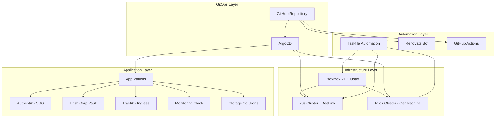

### Multi-Environment Strategy

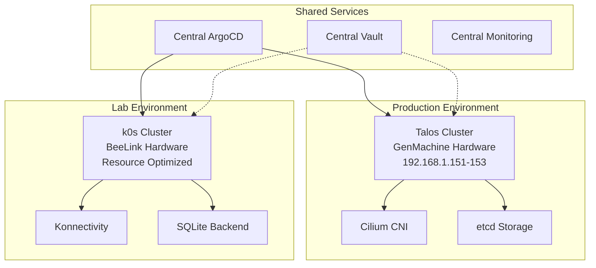

---

## ⚙️ Taskfile.yaml Analysis

The main Taskfile.yaml serves as the orchestration hub for all operational tasks across the infrastructure.

### Core Structure

```yaml
version: '3'
vars:
  K0S_ROOT: '{{.ROOT_DIR}}/infra/k0s'
  TALOS_ROOT: '{{.ROOT_DIR}}/infra/talos'
  GITOPS_ROOT: '{{.ROOT_DIR}}/gitops'
  VAULT_ENDPOINT: 'https://vault.k0s-fullstack.fredcorp.com'
  AUTHENTIK_ENDPOINT_GENMACHINE: 'https://authentik.talos-genmachine.fredcorp.com'
  K8S_API: 'talos-cluster.genmachine.fredcorp.com'
```

### Task Modules

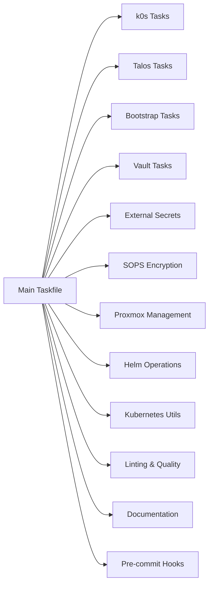

### Key Task Categories

#### 1. Infrastructure Management
- **Proxmox**: VM creation, management, and configuration
- **Talos**: Cluster bootstrapping, configuration, and lifecycle
- **k0s**: Cluster deployment and management

#### 2. GitOps Operations
- **ArgoCD**: Application deployment and synchronization
- **Helm**: Chart management and templating
- **Kustomize**: Manifest customization

#### 3. Security & Secrets
- **SOPS**: File encryption and decryption
- **Vault**: Secret management and policy configuration
- **External Secrets**: Secret synchronization

#### 4. Development & Quality
- **Pre-commit**: Code quality enforcement
- **Linting**: YAML, Helm, and Kubernetes manifest validation
- **Documentation**: MkDocs site generation

---

## 🔄 ArgoCD Ecosystem

ArgoCD serves as the GitOps engine, implementing the "App of Apps" pattern for scalable application management.

### ArgoCD Architecture

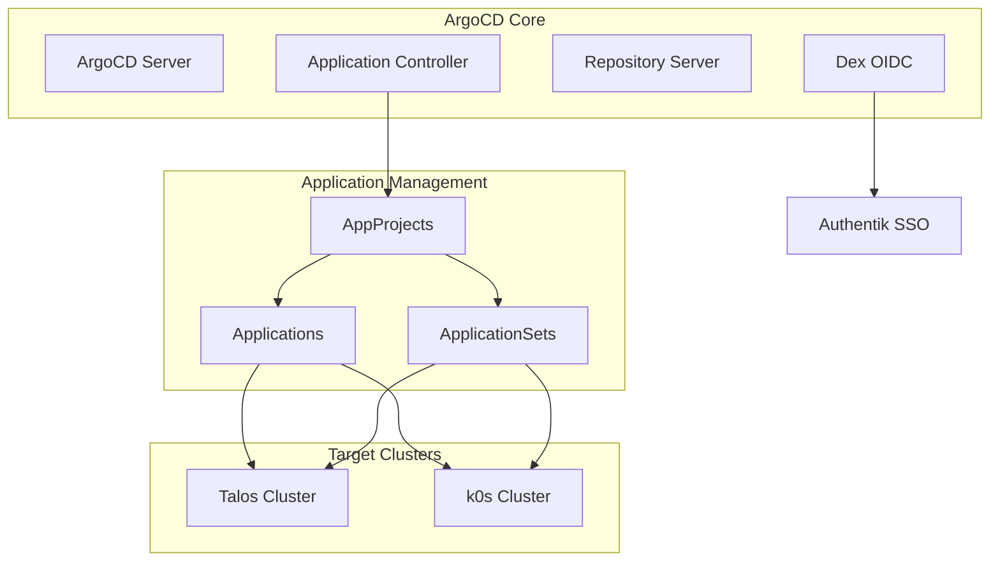

### Repository Structure

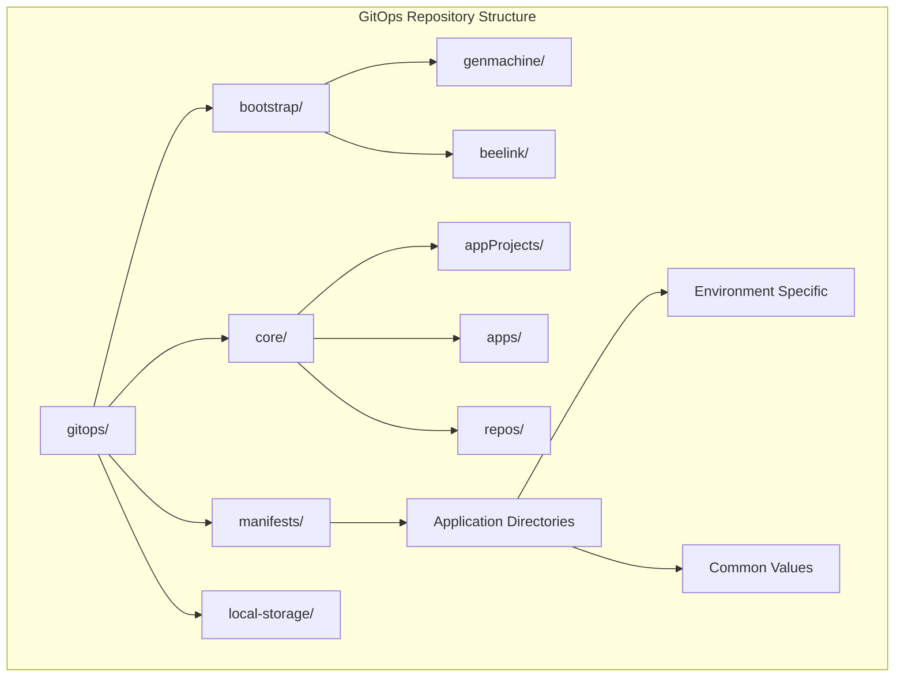

### Application Projects

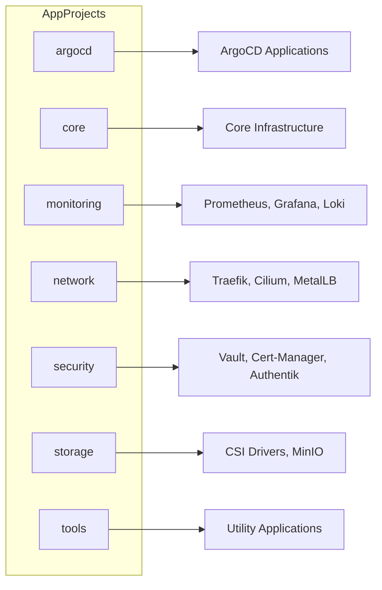

### ApplicationSet Pattern

```yaml
apiVersion: argoproj.io/v1alpha1
kind: ApplicationSet
metadata:
  name: cert-manager
  namespace: argocd
spec:
  generators:
    - git:
        repoURL: "https://github.com/ixxeL-DevOps/fullstack.git"
        revision: main
        directories:
          - path: "gitops/manifests/cert-manager/*"
            exclude: false
          - path: "gitops/manifests/cert-manager/values/*"
            exclude: true
  template:
    metadata:
      name: "cert-manager-{{ .path.basenameNormalized }}"
    spec:
      project: security
      destination:
        name: "{{ .path.basenameNormalized }}"
        namespace: cert-manager
      sources:
        - path: "gitops/manifests/cert-manager/{{ .path.basenameNormalized }}"
          repoURL: https://github.com/ixxeL-DevOps/fullstack.git
          targetRevision: main
          helm:
            valueFiles:
              - $values/gitops/manifests/cert-manager/values/common-values.yaml
              - $values/gitops/manifests/cert-manager/{{ .path.basenameNormalized }}/{{ .path.basenameNormalized }}-values.yaml
```

---

## 🐧 Talos Ecosystem

Talos Linux provides an immutable, API-driven Kubernetes platform optimized for security and simplicity.

### Talos Cluster Architecture

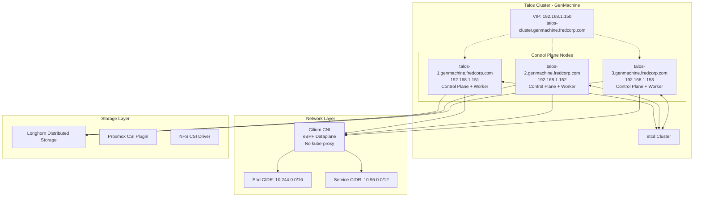

### Talos Configuration Hierarchy

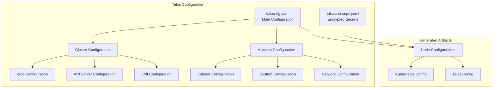

### Key Talos Features

#### 1. **Immutable Infrastructure**
- Read-only root filesystem
- API-driven configuration
- Atomic updates via system extensions

#### 2. **Security Hardening**
- No shell access by default
- Minimal attack surface
- Secure by default configuration

#### 3. **Kubernetes Optimization**
- Optimized for container workloads
- Built-in Kubernetes support
- Efficient resource utilization

#### 4. **System Extensions**
```yaml
systemExtensions:
  officialExtensions:
    - siderolabs/amd-ucode      # AMD microcode updates
    - siderolabs/amdgpu         # AMD GPU support
    - siderolabs/iscsi-tools    # iSCSI support for Longhorn
    - siderolabs/util-linux-tools # Additional Linux utilities
```

### Talos Bootstrap Process

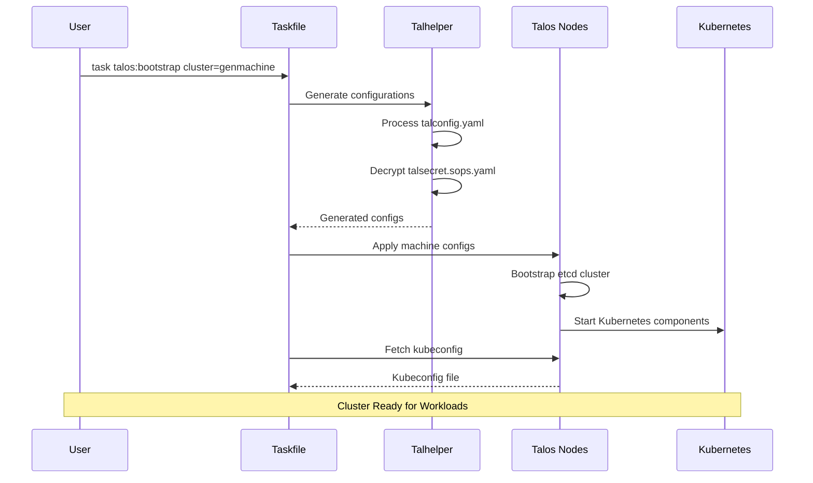

---

## 🔧 Infrastructure Components

### Core Infrastructure Stack

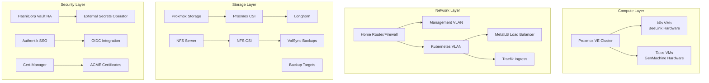

### Application Portfolio

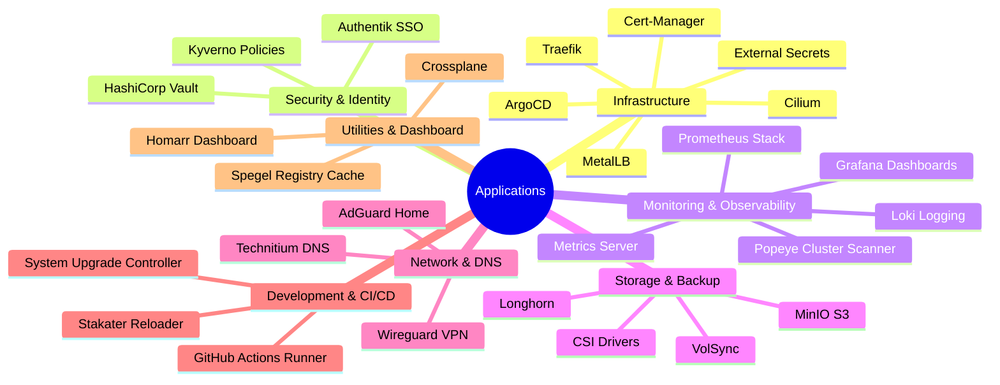

---

## 🔄 GitOps Workflow

### GitOps Process Flow

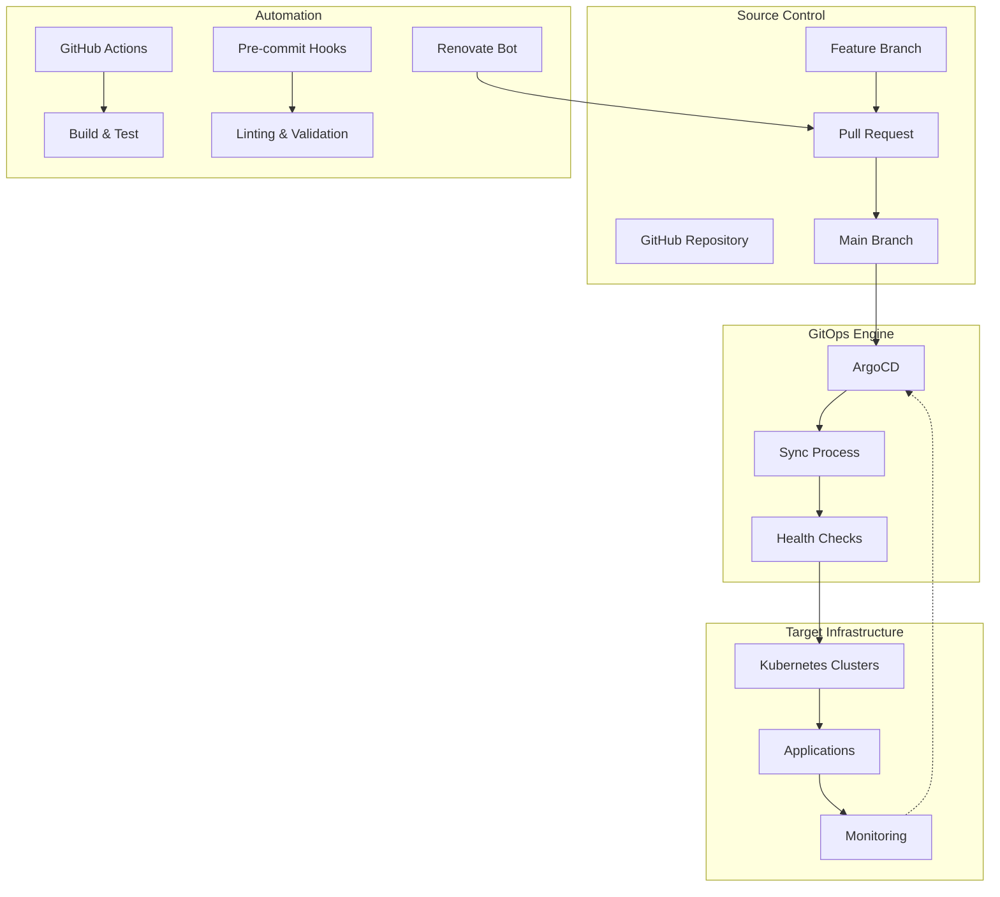

### Deployment Strategies

#### 1. **Application Deployment**
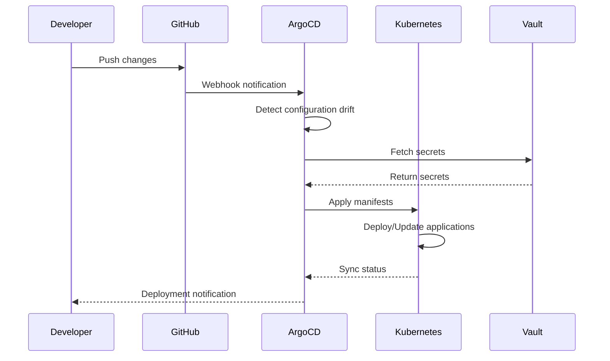

#### 2. **Secret Management Flow**
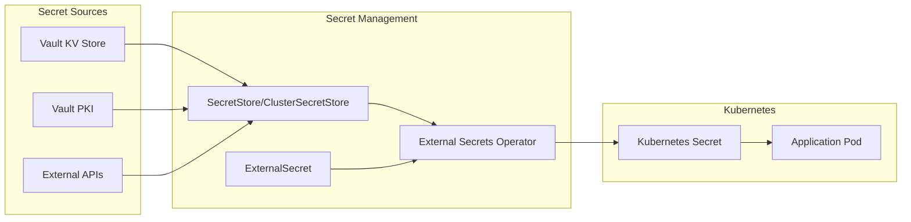

---

## 🔐 Security & Secrets Management

### HashiCorp Vault Architecture

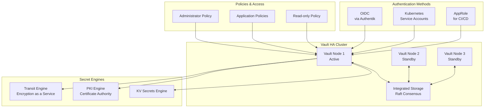

### Authentik SSO Integration

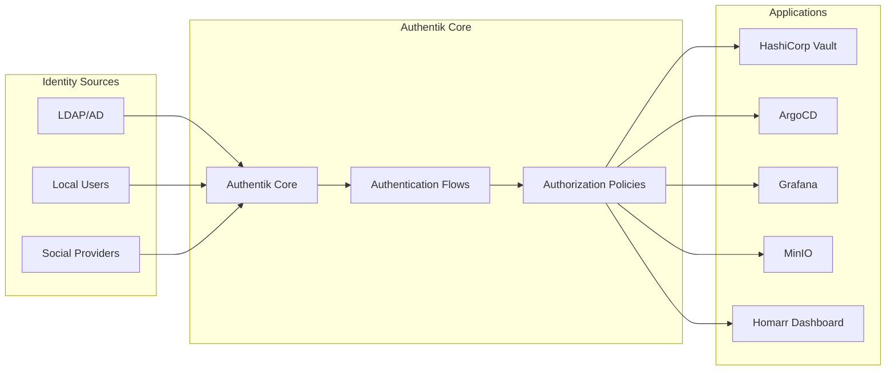

### Certificate Management

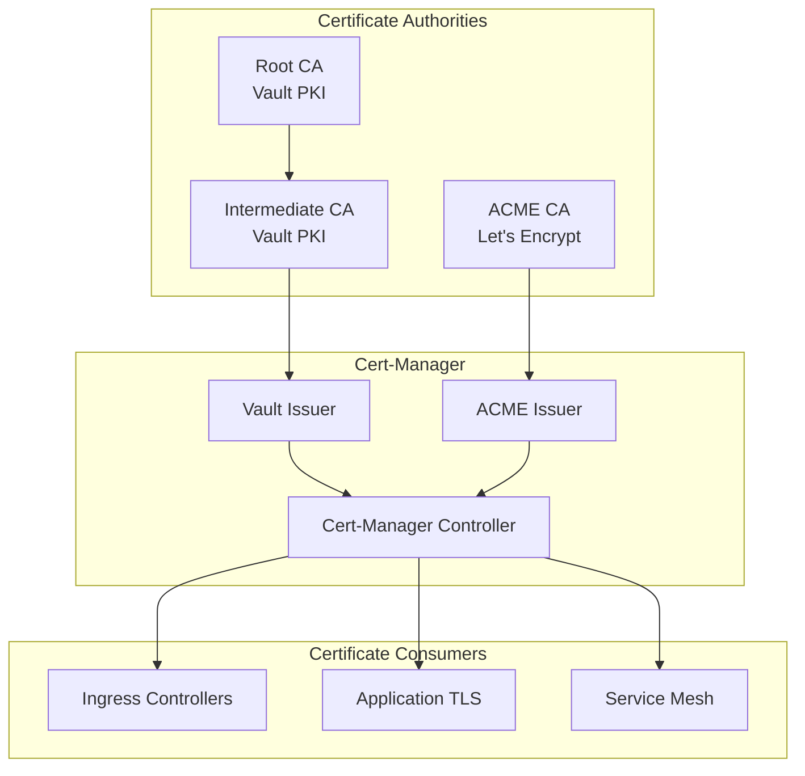

---

## 🤖 Automation & CI/CD

### GitHub Actions Workflows

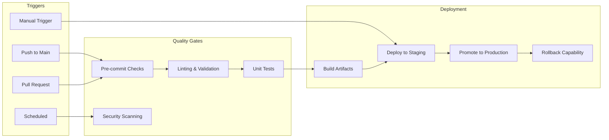

### Renovate Configuration

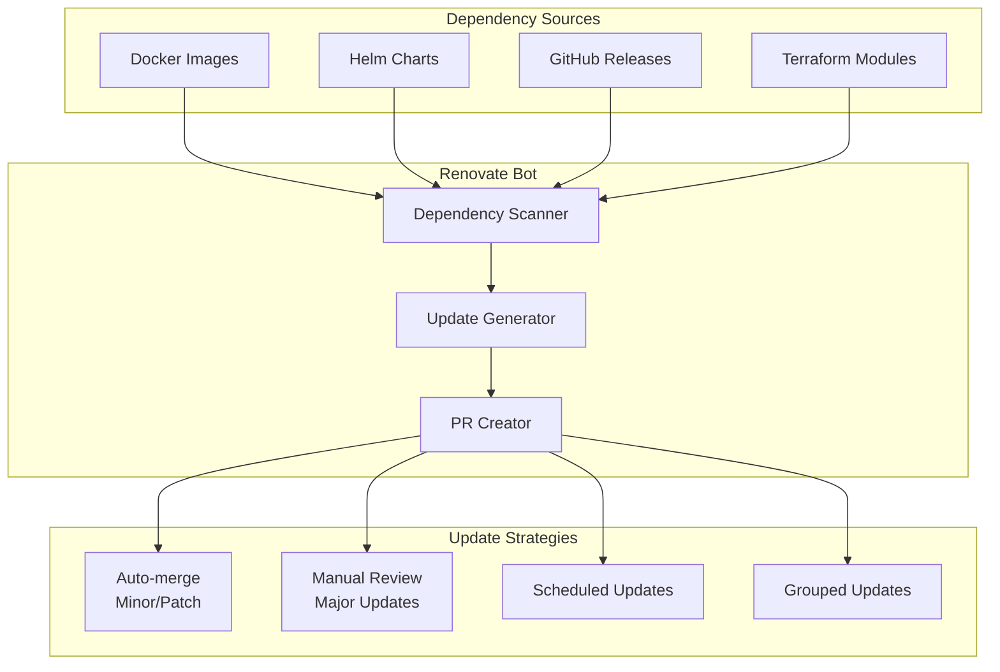

### Task Automation Framework

```mermaid
graph TB
    subgraph "Task Categories"
        INFRA[Infrastructure Tasks]
        K8S[Kubernetes Tasks]
        SECURITY[Security Tasks]
        QUALITY[Quality Assurance]
        DOCS[Documentation]
    end
    
    subgraph "Infrastructure Tasks"
        PROXMOX_TASKS[Proxmox Management]
        TALOS_TASKS[Talos Operations]
        K0S_TASKS[k0s Operations]
        NETWORK_TASKS[Network Configuration]
    end
    
    subgraph "Kubernetes Tasks"
        DEPLOY_TASKS[Deployment Tasks]
        DEBUG_TASKS[Debugging Tools]
        BACKUP_TASKS[Backup Operations]
        MONITOR_TASKS[Monitoring Tasks]
    end
    
    subgraph "Security Tasks"
        VAULT_TASKS[Vault Operations]
        SOPS_TASKS[SOPS Encryption]
        CERT_TASKS[Certificate Management]
        SECRET_TASKS[Secret Management]
    end
    
    INFRA --> PROXMOX_TASKS
    INFRA --> TALOS_TASKS
    INFRA --> K0S_TASKS
    INFRA --> NETWORK_TASKS
    
    K8S --> DEPLOY_TASKS
    K8S --> DEBUG_TASKS
    K8S --> BACKUP_TASKS
    K8S --> MONITOR_TASKS
    
    SECURITY --> VAULT_TASKS
    SECURITY --> SOPS_TASKS
    SECURITY --> CERT_TASKS
    SECURITY --> SECRET_TASKS
```

---

## 📊 Monitoring & Observability

### Observability Stack

```mermaid
graph TB
    subgraph "Data Collection"
        PROMETHEUS[Prometheus]
        LOKI[Loki]
        TEMPO[Tempo - Tracing]
        NODE_EXPORTER[Node Exporter]
        CADVISOR[cAdvisor]
        KUBE_STATE[Kube State Metrics]
    end
    
    subgraph "Visualization"
        GRAFANA[Grafana]
        DASHBOARDS[Custom Dashboards]
        ALERTS[Alert Manager]
    end
    
    subgraph "Storage"
        PROMETHEUS_STORAGE[Prometheus TSDB]
        LOKI_STORAGE[Loki Object Storage]
        TEMPO_STORAGE[Tempo Storage]
    end
    
    subgraph "Applications"
        APP_METRICS[Application Metrics]
        APP_LOGS[Application Logs]
        APP_TRACES[Application Traces]
    end
    
    NODE_EXPORTER --> PROMETHEUS
    CADVISOR --> PROMETHEUS
    KUBE_STATE --> PROMETHEUS
    APP_METRICS --> PROMETHEUS
    
    APP_LOGS --> LOKI
    APP_TRACES --> TEMPO
    
    PROMETHEUS --> PROMETHEUS_STORAGE
    LOKI --> LOKI_STORAGE
    TEMPO --> TEMPO_STORAGE
    
    PROMETHEUS --> GRAFANA
    LOKI --> GRAFANA
    TEMPO --> GRAFANA
    
    GRAFANA --> DASHBOARDS
    PROMETHEUS --> ALERTS
```

### Monitoring Architecture

```mermaid
flowchart LR
    subgraph "Data Sources"
        K8S_METRICS[Kubernetes Metrics]
        APP_METRICS[Application Metrics]
        INFRA_METRICS[Infrastructure Metrics]
        LOGS[Container Logs]
    end
    
    subgraph "Collection Layer"
        PROMETHEUS_OP[Prometheus Operator]
        PROMTAIL[Promtail]
        FLUENT_BIT[Fluent Bit]
    end
    
    subgraph "Storage Layer"
        PROM_STORAGE[Prometheus Storage]
        LOKI_BACKEND[Loki Backend]
        OBJECT_STORAGE[MinIO S3]
    end
    
    subgraph "Visualization"
        GRAFANA_UI[Grafana Dashboards]
        ALERT_MGR[Alert Manager]
        NOTIFICATIONS[Notifications]
    end
    
    K8S_METRICS --> PROMETHEUS_OP
    APP_METRICS --> PROMETHEUS_OP
    INFRA_METRICS --> PROMETHEUS_OP
    LOGS --> PROMTAIL
    LOGS --> FLUENT_BIT
    
    PROMETHEUS_OP --> PROM_STORAGE
    PROMTAIL --> LOKI_BACKEND
    FLUENT_BIT --> LOKI_BACKEND
    
    LOKI_BACKEND --> OBJECT_STORAGE
    
    PROM_STORAGE --> GRAFANA_UI
    LOKI_BACKEND --> GRAFANA_UI
    PROM_STORAGE --> ALERT_MGR
    ALERT_MGR --> NOTIFICATIONS
```

---

## 🚀 Getting Started

### Prerequisites Setup

1. **Install Development Tools**
   ```bash
   # Install Devbox for dependency management
   curl -fsSL https://get.jetify.com/devbox | bash
   
   # Initialize devbox environment
   devbox shell
   ```

2. **Configure Environment**
   ```bash
   # Clone the repository
   git clone https://github.com/ixxeL-DevOps/fullstack.git
   cd fullstack
   
   # Install dependencies via devbox
   devbox add talosctl kubectl go-task sops vault helm
   ```

3. **Infrastructure Prerequisites**
   - Proxmox VE cluster with sufficient resources
   - Static IP reservations for cluster nodes
   - DNS resolution for cluster endpoints
   - Storage backend (NFS, iSCSI, or local storage)

### Deployment Process

#### 1. **Talos Cluster Deployment**
```bash
# Generate Talos secrets
task talos:gen-secrets cluster=genmachine

# Bootstrap the cluster
task talos:bootstrap cluster=genmachine

# Verify cluster status
kubectl --context genmachine get nodes
```

#### 2. **k0s Cluster Deployment**
```bash
# Deploy k0s cluster
task k0s:deploy

# Verify cluster status
kubectl --context k0s get nodes
```

#### 3. **GitOps Bootstrap**
```bash
# Deploy ArgoCD
kubectl apply -k gitops/bootstrap/genmachine

# Sync applications
argocd app sync --all
```

### Operational Tasks

#### Daily Operations
```bash
# Check cluster health
task k8s:approve-certs cluster=genmachine
task k8s:delete-failed-pods cluster=genmachine

# Update dependencies
task renovate:run

# Backup operations
task restic:backup
```

#### Troubleshooting
```bash
# Debug networking
task k8s:netshoot cluster=genmachine

# Browse persistent volumes
task k8s:browse-pvc

# Check what's running
task k8s:what-dockerhub
```

---

## 📚 Additional Resources

### Documentation Structure
- `/docs/` - Comprehensive documentation
- `/gitops/` - GitOps manifests and configurations
- `/infra/` - Infrastructure as Code
- `/.taskfiles/` - Automation scripts and tasks

### Key Files
- `Taskfile.yaml` - Main automation entry point
- `devbox.json` - Development environment definition
- `mkdocs.yml` - Documentation site configuration
- `.pre-commit-config.yaml` - Code quality hooks

### External References
- [Talos Linux Documentation](https://www.talos.dev/)
- [ArgoCD Documentation](https://argo-cd.readthedocs.io/)
- [k0s Documentation](https://docs.k0sproject.io/)
- [Cilium Documentation](https://docs.cilium.io/)
- [HashiCorp Vault Documentation](https://www.vaultproject.io/docs)

---

This documentation provides a comprehensive overview of the ixxeL-DevOps fullstack repository, covering all major components, workflows, and operational procedures. The repository represents a mature, production-ready home lab infrastructure that demonstrates modern DevOps and GitOps practices.
