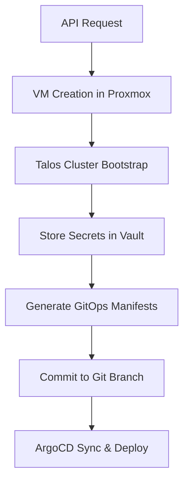

# New Cluster Provisioning - Genmachine Pattern

## Overview

This document describes the automated process to provision a new Kubernetes cluster using Talos Linux and deploy it using the established GitOps workflow similar to the existing `genmachine` cluster. The process leverages infrastructure automation with Proxmox, Talos bootstrapping, and ArgoCD-driven application deployment.

## Architecture

The new cluster provisioning system consists of several components working together:

1. **Proxmox VM Provisioning**: Automated VM creation and configuration
2. **Talos Bootstrap**: Kubernetes cluster initialization using Talos Linux
3. **Vault Integration**: Secure storage of cluster credentials and configurations
4. **GitOps Manifests**: Automated generation and deployment of cluster applications
5. **Python Provisioning Service**: Orchestration API for the entire process

## Prerequisites

- Proxmox VE server cluster available for VM provisioning
- Talos Linux ISO and Talos CLI (`talosctl`) installed
- Access to HashiCorp Vault for storing secrets and configurations
- ArgoCD configured to watch GitOps manifests
- Devbox environment with required CLI tools
- Python 3.9+ with FastAPI and uvicorn

## Process Overview



## Detailed Steps

### 1. VM Provisioning in Proxmox

The system creates virtual machines in Proxmox following the established pattern:

- **Control Plane Nodes**: 3 VMs with sequential VMID prefixes
- **Worker Nodes**: Configurable number of worker VMs
- **Network Configuration**: Static IP assignment with MAC address binding
- **Resource Allocation**: CPU, memory, and storage based on cluster requirements

**VM Naming Convention:**
```
{cluster-name}-cp-{number}    # Control plane nodes
{cluster-name}-wk-{number}    # Worker nodes
```

**Example VM Configuration:**
```yaml
vars:
  CLUSTER_NAME: "production"
  VMID_PREFIX: 40
  CP_VMS: "1-XX:XX:XX:XX:XX:01-192.168.2.161 2-XX:XX:XX:XX:XX:02-192.168.2.162 3-XX:XX:XX:XX:XX:03-192.168.2.163"
  WK_VMS: "4-XX:XX:XX:XX:XX:04-192.168.2.164 5-XX:XX:XX:XX:XX:05-192.168.2.165"
```

### 2. Talos Cluster Bootstrap

The Talos bootstrap process includes:

1. **Generate Cluster Secrets**: Create unique encryption keys and certificates
2. **Machine Configuration**: Generate control plane and worker node configs
3. **VM Preparation**: Apply machine configs to newly created VMs
4. **etcd Bootstrap**: Initialize the distributed key-value store
5. **Kubernetes Installation**: Deploy Kubernetes components
6. **Kubeconfig Generation**: Create cluster access credentials

**Key Configuration Parameters:**
- Cluster Name
- Control Plane VIP (Virtual IP for HA)
- Pod/Service CIDR ranges
- DNS configuration
- Container registry settings

### 3. Vault Secret Management

All cluster credentials and sensitive configurations are stored in HashiCorp Vault:

**Vault Paths:**
```
admin/kubernetes/{cluster-name}/talos     # Talos configuration
admin/kubernetes/{cluster-name}/kubeconfig # Kubernetes access
admin/kubernetes/{cluster-name}/secrets   # Additional secrets
```

**Stored Information:**
- Talos client configuration
- Kubernetes kubeconfig
- Cluster CA certificates
- Bootstrap tokens
- Encryption keys

### 4. GitOps Manifest Generation

The system automatically generates GitOps manifests based on the `genmachine` template:

**Directory Structure:**
```
gitops/
├── core/
│   ├── apps/{cluster-name}/           # Application definitions
│   └── clusters/{cluster-name}/       # Cluster-specific configs
├── bootstrap/{cluster-name}/          # Bootstrap applications
└── manifests/                         # Application value files
    └── {app-name}/{cluster-name}/
```

**Generated Components:**
- ArgoCD Applications
- ApplicationSets for multi-cluster deployment
- Cluster-specific value files
- External Secrets for Vault integration
- Ingress and networking configurations

### 5. Application Deployment

Applications are deployed through ArgoCD using the GitOps pattern:

**Core Applications:**
- cert-manager (TLS certificate management)
- external-secrets (Vault integration)
- ingress-nginx (HTTP/HTTPS ingress)
- metallb (Load balancer for bare metal)
- longhorn (Persistent storage)
- monitoring stack (Prometheus, Grafana)

**Application Configuration:**
Each application includes:
- Helm values specific to the cluster
- Resource quotas and limits
- Network policies
- RBAC configurations
- Persistent volume claims

## Python Provisioning Service

### API Endpoints

**POST /api/v1/clusters**
Create a new Kubernetes cluster

```json
{
  "cluster_name": "production",
  "vmid_prefix": 40,
  "control_plane_nodes": 3,
  "worker_nodes": 2,
  "network_config": {
    "vip": "192.168.2.160",
    "node_ips": ["192.168.2.161", "192.168.2.162", "192.168.2.163"],
    "pod_cidr": "10.244.0.0/16",
    "service_cidr": "10.96.0.0/12"
  },
  "resource_config": {
    "cpu_cores": 4,
    "memory_gb": 8,
    "storage_gb": 100
  }
}
```

**GET /api/v1/clusters/{cluster_name}/status**
Get cluster provisioning status

**DELETE /api/v1/clusters/{cluster_name}**
Delete a cluster (cleanup VMs and GitOps manifests)

### Service Architecture

```python
# FastAPI application structure
app/
├── main.py                 # FastAPI application
├── models/                 # Pydantic models
│   ├── cluster.py
│   └── responses.py
├── services/               # Business logic
│   ├── proxmox.py         # VM management
│   ├── talos.py           # Cluster bootstrap
│   ├── vault.py           # Secret management
│   └── gitops.py          # Manifest generation
├── utils/                  # Utility functions
│   ├── taskfile.py        # Taskfile execution
│   └── git.py             # Git operations
└── config.py              # Configuration management
```

## Taskfile Integration

### New Cluster Tasks

```yaml
# Taskfile.yml additions
version: '3'

vars:
  CLUSTER_NAME: '{{.CLUSTER_NAME | default "newcluster"}}'
  VMID_PREFIX: '{{.VMID_PREFIX | default "50"}}'

tasks:
  cluster:create:
    desc: Create a new Kubernetes cluster
    cmds:
      - task: proxmox:create-vms
      - task: talos:bootstrap
      - task: vault:store-secrets
      - task: gitops:generate
    vars:
      CLUSTER_NAME: '{{.CLUSTER_NAME}}'

  proxmox:create-vms:
    desc: Create VMs in Proxmox for new cluster
    cmds:
      - python scripts/proxmox_create_vms.py --cluster {{.CLUSTER_NAME}} --prefix {{.VMID_PREFIX}}

  talos:bootstrap:
    desc: Bootstrap Talos cluster
    cmds:
      - cd infra/talos && task bootstrap cluster={{.CLUSTER_NAME}}

  vault:store-secrets:
    desc: Store cluster secrets in Vault
    cmds:
      - python scripts/vault_store_secrets.py --cluster {{.CLUSTER_NAME}}

  gitops:generate:
    desc: Generate GitOps manifests for new cluster
    cmds:
      - python scripts/gitops_generate.py --cluster {{.CLUSTER_NAME}}
```

## Security Considerations

### Network Security
- All cluster communication encrypted with TLS
- Network policies to restrict inter-pod communication
- Firewall rules for cluster node access
- VPN or bastion host access for management

### Secret Management
- All secrets stored in Vault with encryption at rest
- Automatic secret rotation where possible
- Principle of least privilege for service accounts
- Audit logging for secret access

### Access Control
- RBAC policies for different user roles
- Service account tokens with limited scope
- Multi-factor authentication for cluster access
- Regular access reviews and cleanup

## Monitoring and Observability

### Cluster Health Monitoring
- Node resource utilization
- Pod status and restarts
- Network connectivity tests
- Storage performance metrics

### Application Monitoring
- Application-specific metrics
- Custom dashboards in Grafana
- Alerting rules for critical issues
- Log aggregation and analysis

### Backup and Disaster Recovery
- etcd snapshots scheduled regularly
- Persistent volume backups
- Configuration backups in Git
- Documented recovery procedures

## Troubleshooting Guide

### Common Issues

**VM Creation Failures**
- Check Proxmox resource availability
- Verify network configuration
- Validate MAC address uniqueness

**Talos Bootstrap Issues**
- Verify VM network connectivity
- Check Talos ISO version compatibility
- Validate machine configuration syntax

**GitOps Sync Problems**
- Check ArgoCD application health
- Verify Git repository access
- Validate Helm chart syntax

**Application Deployment Failures**
- Review application logs
- Check resource quotas and limits
- Verify external dependencies

### Debugging Commands

```bash
# Check cluster status
kubectl get nodes
kubectl get pods --all-namespaces

# Talos specific debugging
talosctl health --cluster {{cluster-name}}
talosctl logs --cluster {{cluster-name}}

# ArgoCD application status
argocd app list
argocd app get {{app-name}}
```

## Future Enhancements

### Planned Features
- Multi-cloud support (AWS, GCP, Azure)
- Cluster autoscaling configuration
- Advanced networking with Cilium
- Service mesh integration (Istio/Linkerd)
- GitOps progressive delivery

### Integration Opportunities
- CI/CD pipeline integration
- Infrastructure as Code with Terraform
- Policy as Code with Open Policy Agent
- Chaos engineering with Chaos Mesh

## Conclusion

This new cluster provisioning system provides a fully automated, secure, and scalable approach to Kubernetes cluster deployment. By following the established genmachine pattern and leveraging modern GitOps practices, teams can rapidly provision production-ready clusters with consistent configuration and comprehensive observability.

The combination of Talos Linux, HashiCorp Vault, and ArgoCD provides a robust foundation for enterprise Kubernetes deployments while maintaining security best practices and operational excellence.
