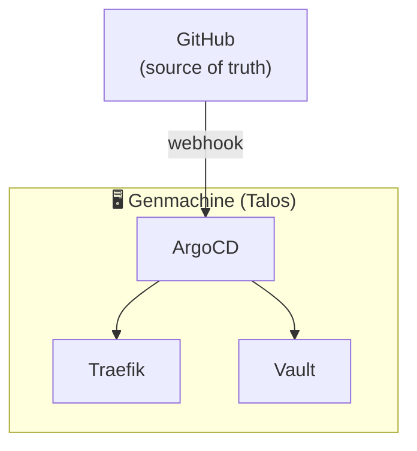
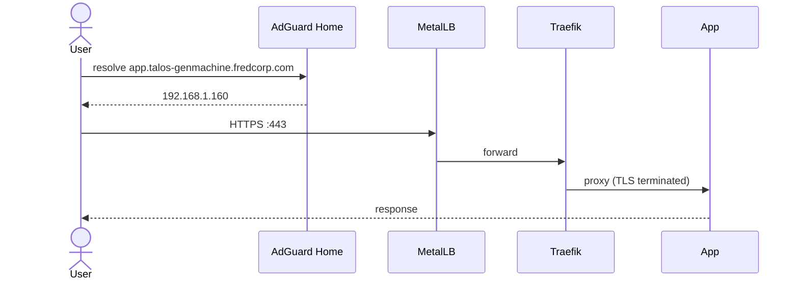
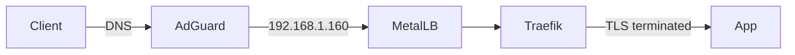
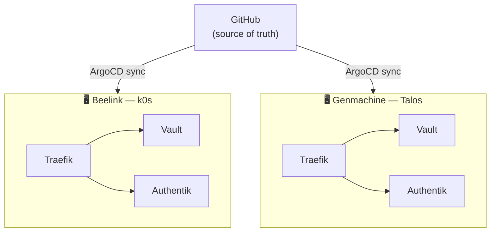
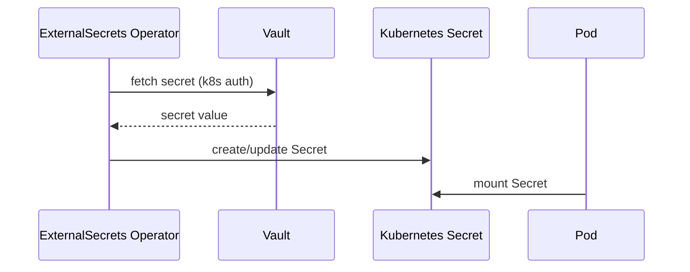

# Mermaid Diagram Guide

## Supported Diagram Types

Mermaid is rendered natively in:
- **MkDocs** (via `pymdownx.superfences` — configured in `mkdocs.yml`)
- **GitHub** (native support since 2022 — works in `.md` files, issues, PRs)
- **README.md and docs/*.md** — use ` ```mermaid ` fences

---

## Diagram Types and When to Use Them

| Type | Directive | Use for |
|---|---|---|
| Flowchart | `graph TB` / `graph LR` | Architecture, component relationships, data flows |
| Sequence | `sequenceDiagram` | Protocol flows, auth sequences, request/response |
| State | `stateDiagram-v2` | Lifecycle states (pod, ESO, ArgoCD app) |
| Gitgraph | `gitGraph` | Branch strategies |

---

## Syntax Rules

### Flowchart



- Use `TB` (top-bottom) for architecture diagrams; `LR` (left-right) for flows
- Use `subgraph` for logical groupings (clusters, namespaces, layers)
- Node IDs are camelCase; labels can contain spaces and emoji
- Arrow labels: `-->|label|`
- Use `["label"]` for rectangles, `(["label"])` for rounded, `{{"label"}}` for diamonds

### Sequence Diagram



- Use `actor` for external users
- `->>` for solid arrows (requests), `-->>` for dashed (responses)
- Add `participant X as "Label"` to alias long names

---

## Style Guidelines

1. **Keep diagrams focused** — one diagram per concept; don't try to show everything
2. **Use real names** — `vault.talos-genmachine.fredcorp.com` not `my-service`
3. **Subgraphs for clusters** — always wrap cluster components in a labeled subgraph
4. **Minimal labels** — arrow labels should be verbs or protocols, not sentences
5. **Prefer TB for architecture** — left-to-right is better for request flows
6. **Emoji in subgraph labels** — `🖥️`, `☁️`, `🔐` help distinguish cluster types visually

---

## MkDocs Integration

Mermaid blocks in MkDocs Material use this fenced syntax:

````markdown

````

The `pymdownx.superfences` configuration in `mkdocs.yml` handles rendering:

```yaml
- pymdownx.superfences:
    custom_fences:
      - name: mermaid
        class: mermaid
        format: !!python/name:pymdownx.superfences.fence_code_format
```

No extra JavaScript is needed when using MkDocs Material.

---

## Common Patterns in This Repo

### Traffic Flow (standard)



### Dual Cluster Overview



### Secret Sync Flow


