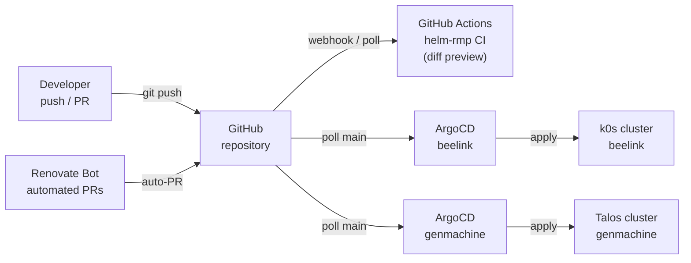
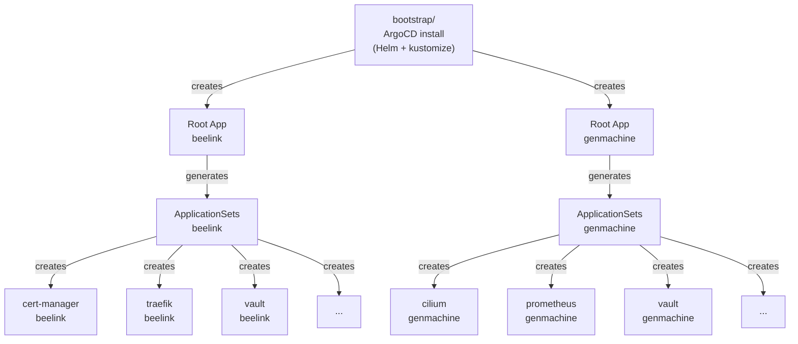
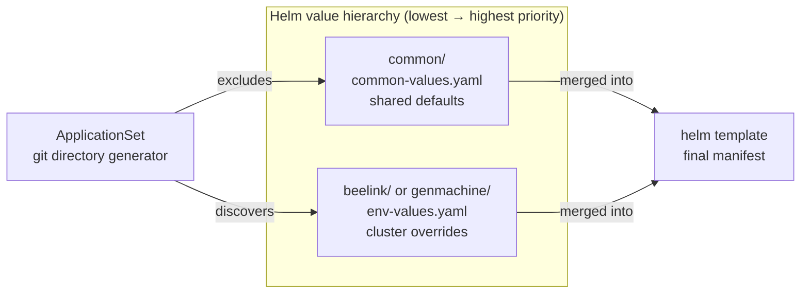

# GitOps with ArgoCD

> [!CAUTION]
> This structure is opinionated and results from multiple experiences using ArgoCD in enterprise-grade environments.

## Overview

This Git repository serves as the central ArgoCD repository, containing the definition of the ArgoCD deployment itself, as well as the various ArgoCD objects (`Application`, `ApplicationSet`, `AppProject`, etc.).

The installation of ArgoCD follows the [App of Apps pattern](https://argo-cd.readthedocs.io/en/stable/operator-manual/cluster-bootstrapping/#app-of-apps-pattern), a recommended best practice for managing GitOps deployments at scale.

## GitOps Reconciliation Loop



## App of Apps Pattern



## Repository Structure

```bash
gitops
├── bootstrap
│   ├── beelink
│   │   └── beelink-values.yaml   # ArgoCD Helm values for beelink
│   └── genmachine
│       └── genmachine-values.yaml
├── core
│   ├── appProjects               # RBAC project definitions
│   ├── apps
│   │   ├── beelink               # ApplicationSets for k0s cluster
│   │   └── genmachine            # ApplicationSets for Talos cluster
│   ├── clusters                  # Cluster secret references
│   └── repos                    # Repository credentials
└── manifests
    ├── cert-manager
    ├── cilium
    ├── traefik
    ├── vault
    └── ...                       # 30+ applications
```

## Multi-Environment Helm Structure

Each application directory follows a consistent layout that separates shared configuration from cluster-specific overrides:

```bash
gitops/manifests/
├── cert-manager
│   ├── common                    # shared across all clusters
│   │   └── common-values.yaml
│   ├── beelink                   # k0s cluster overrides
│   │   ├── Chart.yaml
│   │   ├── beelink-values.yaml
│   │   └── templates
│   └── genmachine                # Talos cluster overrides
│       ├── Chart.yaml
│       ├── genmachine-values.yaml
│       └── templates
└── traefik
    ├── common
    │   └── common-values.yaml
    ├── beelink
    │   └── ...
    └── genmachine
        └── ...
```



## ApplicationSet Usage

`ApplicationSet` discovers cluster-specific directories automatically, then overlays the common values file on top.

```yaml
---
apiVersion: argoproj.io/v1alpha1
kind: ApplicationSet
metadata:
  name: cert-manager
  namespace: argocd
  annotations:
    argocd.argoproj.io/manifest-generate-paths: .;../common
spec:
  goTemplate: true
  generators:
    - git:
        repoURL: "https://github.com/ixxeL-DevOps/fullstack.git"
        revision: main
        directories:
          - path: "gitops/manifests/cert-manager/*"
            exclude: false
          - path: "gitops/manifests/cert-manager/common"
            exclude: true
  template:
    metadata:
      name: "cert-manager-{{ .path.basenameNormalized }}"
      annotations:
        argocd.argoproj.io/manifest-generate-paths: .;../common
    spec:
      project: infra-security
      destination:
        name: "{{ .path.basenameNormalized }}"
        namespace: cert-manager
      sources:
        - path: "gitops/manifests/cert-manager/{{ .path.basenameNormalized }}"
          repoURL: https://github.com/ixxeL-DevOps/fullstack.git
          targetRevision: main
          helm:
            valueFiles:
              - $values/gitops/manifests/cert-manager/common/common-values.yaml
              - $values/gitops/manifests/cert-manager/{{ .path.basenameNormalized }}/{{ .path.basenameNormalized }}-values.yaml
            ignoreMissingValueFiles: true
        - repoURL: https://github.com/ixxeL-DevOps/fullstack.git
          targetRevision: main
          ref: values
      syncPolicy:
        automated:
          prune: true
          selfHeal: true
        syncOptions:
          - Validate=true
          - PruneLast=false
          - RespectIgnoreDifferences=true
          - Replace=false
          - ApplyOutOfSyncOnly=true
          - CreateNamespace=true
          - ServerSideApply=true
```

The `manifest-generate-paths` annotation (`.;../common`) ensures that ArgoCD refreshes the application when either the cluster-specific directory **or** the shared `common/` directory changes, following [ArgoCD optimization recommendations](https://argo-cd.readthedocs.io/en/stable/operator-manual/high_availability/#manifest-paths-annotation).

### Key Features

- **Multi-cluster support**: The git directory generator discovers `beelink/` and `genmachine/` subdirectories and deploys to the matching cluster destination.
- **Hierarchical Helm values**: `common-values.yaml` provides shared defaults; cluster-specific files override them.
- **Automated synchronization**: Prune + self-heal keeps clusters reconciled with Git at all times.
- **Selective exclusions**: The `common/` directory is excluded from the generator so it is never deployed as a standalone application.
