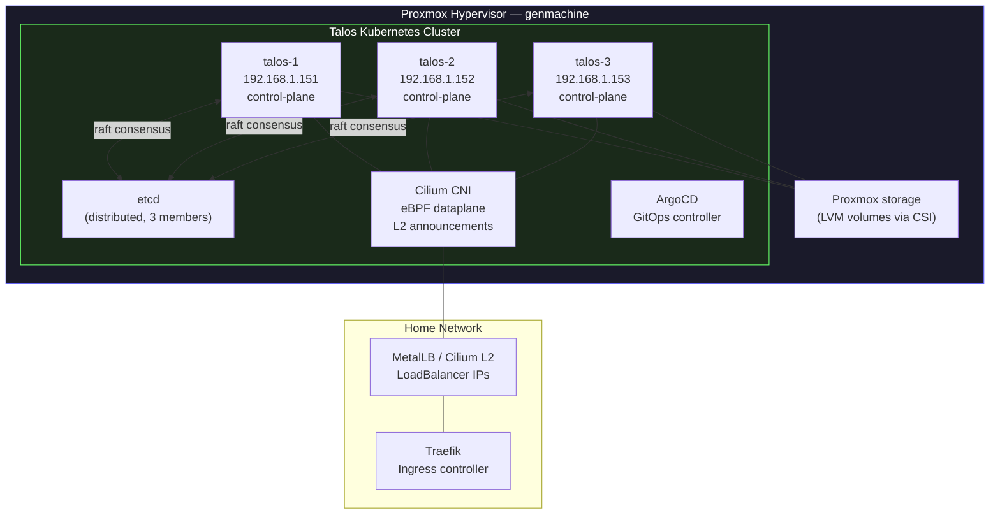

# Talos Cluster Installation Guide

This document details the installation and configuration of a **talos cluster** for my home lab environment. It is based on the provided `talosconfig.yaml` file and explains the technical choices made. Additionally, a **Taskfile** is used to simplify cluster management tasks.

## 🏗️ Cluster Overview

The cluster is a **3 nodes Kubernetes cluster** running on a home server. It uses **Talos Linux** for deployment.

### 🔹 Key Features:

- **Data Storage**: `etcd`
- **CNI (Networking)**: `Cilium`
- **Environment Management**: Uses **Devbox** to handle binaries like `talosctl`, `kubectl`, `task`, and other necessary CLI tools.

### Topology



## 🛠️ Installation

### 📌 Prerequisites

Before installing the cluster, ensure you have:

- **Devbox installed** to manage required tools:
  ```sh
  curl -fsSL https://get.jetify.com/devbox | bash
  ```
- **Set up the environment** using Devbox:
  ```sh
  devbox add talosctl kubectl go-task sops vault
  ```
- **Launch your devbox shell**:
  ```sh
  devbox shell
  ```
- **3 DHCP static IP entries**:
  In router configuration, you should set static IP addresses for target VM MAC addresses.
  For example:

      - `DE:CA:FF:10:12:10` --> `192.168.1.151`
      - `DE:CA:FF:10:12:11` --> `192.168.1.152`
      - `DE:CA:FF:10:12:12` --> `192.168.1.153`

      Variables are set in the Proxmox Taskfile:
      ```yaml
      vars:
      CP_VMS: 1-DE:CA:FF:10:12:10-192.168.1.151 2-DE:CA:FF:10:12:11-192.168.1.152 3-DE:CA:FF:10:12:12-192.168.1.153
      ALL_VMS: '{{.CP_VMS}}'
      VMID_PREFIX: 20
      ```

- **3 nodes running Talos Linux OS**:
  You can execute the Proxmox Talos book for this
  ```bash
  task proxmox:create-talos
  ```

### 🚀 Deploying the Cluster
