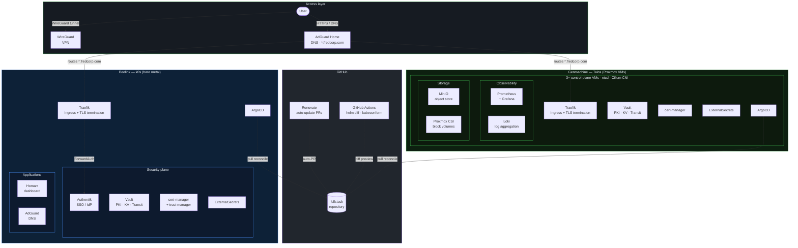
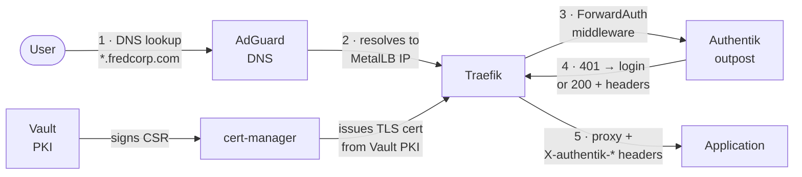

<h1>ixxeL-DevOps HomeLab</h1>

<em>Infrastructure as Code · GitOps · Self-hosted · Fully automated</em>

---

---

## Overview

This repository is the single source of truth for a fully automated homelab running on two Kubernetes clusters. Every component — from cluster bootstrap to application configuration — is declared as code, reconciled by ArgoCD, and kept up-to-date by Renovate.

The two clusters are complementary: **Beelink** (k0s on bare metal) hosts security and access infrastructure, while **Genmachine** (Talos Linux on Proxmox VMs) hosts the production workloads and observability stack. Both share a unified GitOps structure and are managed from a single repository.

=== "Beelink — k0s"

    **Cluster**

    
    

    **Applications**

    
    
    
    
    
    

=== "Genmachine — Talos"

    **Cluster**

    
    
    

    **Applications**

    
    
    
    
    
    

---

## Architecture

### Infrastructure topology

### Request flow — authenticated access

---

## Stack

| Layer | Component | Role |
|---|---|---|
| **Cluster** | [Talos Linux](https://www.talos.dev/) | Immutable, API-driven OS for Genmachine nodes |
| **Cluster** | [k0s](https://k0sproject.io/) | Lightweight single-node Kubernetes for Beelink |
| **GitOps** | [ArgoCD](https://argo-cd.readthedocs.io/) | Continuous reconciliation of all cluster state |
| **GitOps** | [Renovate](https://docs.renovatebot.com/) | Automated dependency update PRs |
| **Networking** | [Cilium](https://cilium.io/) | eBPF CNI with L2 LoadBalancer announcements |
| **Ingress** | [Traefik](https://traefik.io/) | Reverse proxy with automatic TLS and ForwardAuth |
| **DNS** | [AdGuard Home](https://adguard.com/adguard-home/) | Local DNS resolver with ad-blocking |
| **PKI / Secrets** | [HashiCorp Vault](https://www.vaultproject.io/) | PKI CA, KV secrets, Transit auto-unseal |
| **Certificates** | [cert-manager](https://cert-manager.io/) | Automated certificate lifecycle from Vault PKI |
| **Secrets** | [ExternalSecrets](https://external-secrets.io/) | Vault → Kubernetes Secret synchronisation |
| **Auth** | [Authentik](https://goauthentik.io/) | SSO IdP — OIDC provider + ForwardAuth outpost |
| **VPN** | [WireGuard Portal](https://github.com/h44z/wg-portal) | Self-hosted VPN management UI |
| **Observability** | Prometheus · Grafana · Loki | Metrics, dashboards, and log aggregation |
| **Storage** | MinIO · Proxmox CSI | S3-compatible object store + block volumes |
| **Encryption** | [SOPS](https://github.com/getsops/sops) | Secrets encryption in Git via Vault Transit |
