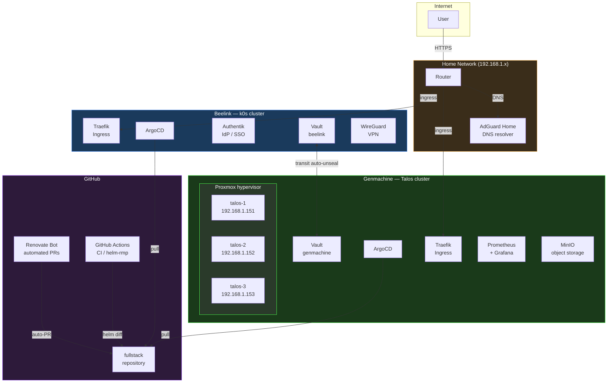

# **My home-lab repository**

**Hosted with k0s & Talos**

**Managed by ArgoCD**

**Powered by Renovate and GitHub**

**Fueled by Cilium**

---

**INFRASTRUCTURE K0S**

**TOOLING**

---

**INFRASTRUCTURE TALOS**

**TOOLING**

---

---

This project utilizes Infrastructure as Code and GitOps to automate provisioning, operating, and updating self-hosted services in my homelab.

## Architecture Overview

