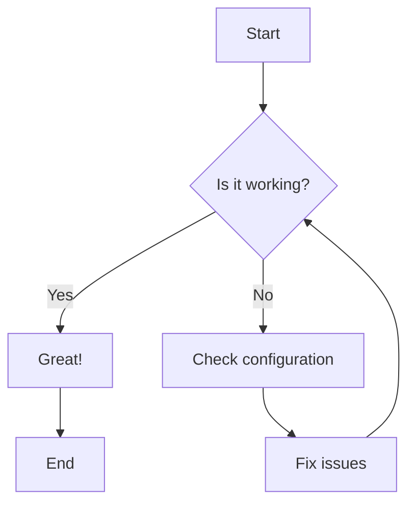
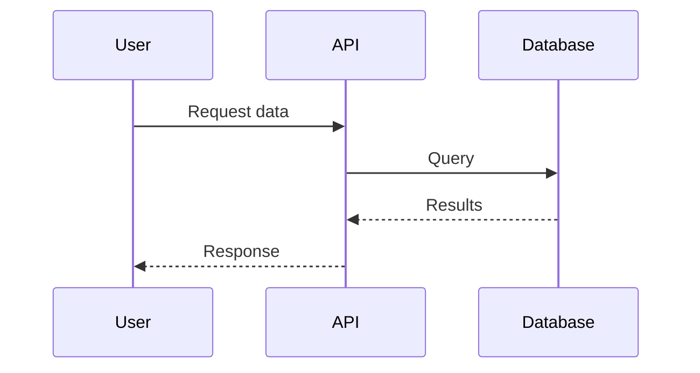
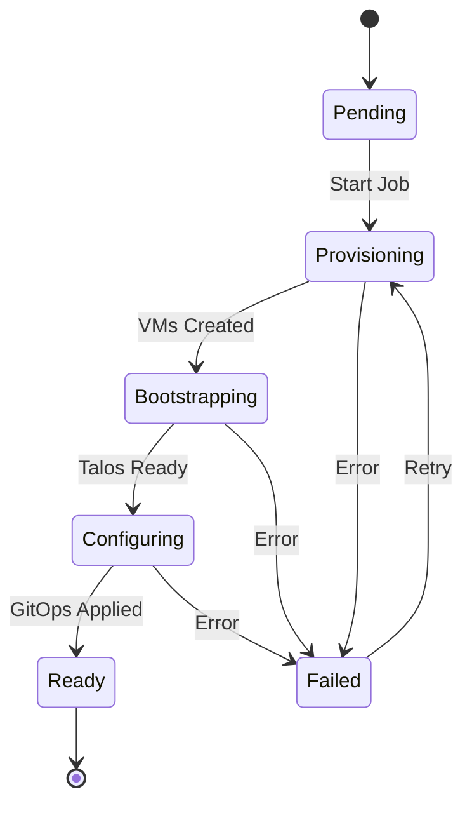

# Mermaid Diagram Test

This page demonstrates the Mermaid diagram support in MkDocs.

## Flowchart Example



## Sequence Diagram Example



## Cluster Architecture Example

```mermaid
graph TB
    subgraph "Proxmox Cluster"
        VM1[Control Plane 1]
        VM2[Control Plane 2] 
        VM3[Control Plane 3]
        VM4[Worker Node 1]
        VM5[Worker Node 2]
    end
    
    subgraph "Load Balancer"
        VIP[Virtual IP]
    end
    
    subgraph "Storage"
        Vault[HashiCorp Vault]
        Storage[Persistent Storage]
    end
    
    VIP --> VM1
    VIP --> VM2
    VIP --> VM3
    
    VM1 --> Storage
    VM2 --> Storage
    VM3 --> Storage
    VM4 --> Storage
    VM5 --> Storage
    
    VM1 --> Vault
    VM2 --> Vault
    VM3 --> Vault
```

## GitOps Workflow

```mermaid
gitgraph
    commit id: "Initial"
    branch feature
    checkout feature
    commit id: "Feature A"
    commit id: "Feature B"
    checkout main
    merge feature
    commit id: "Deploy"
```

## Cluster Provisioning Process



This demonstrates various types of Mermaid diagrams that can be used in the documentation.
