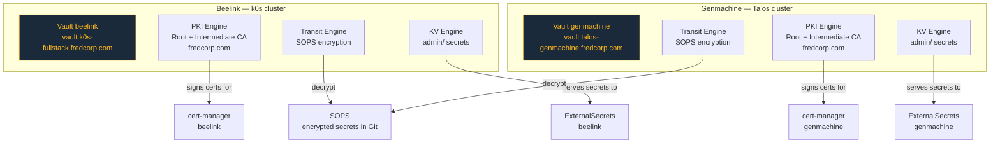

# HashiCorp Vault

## Overview

Two Vault instances are deployed across the two clusters. Each instance serves as both a secrets engine and a PKI certificate authority for its cluster.



## Authentication Methods

### Kubernetes Auth

Used by cert-manager and ExternalSecrets to authenticate with Vault using their ServiceAccount tokens:

```mermaid
sequenceDiagram
    participant app as cert-manager / ESO
    participant k8s as Kubernetes API
    participant vault as Vault

    app->>vault: Login with ServiceAccount JWT<br/>(auth/&lt;cluster&gt;-k8s/login)
    vault->>k8s: TokenReview — validate JWT
    k8s-->>vault: Token valid + bound SA info
    vault-->>app: Vault token (scoped to policy)
    app->>vault: Read secrets / sign certificates
```

Configure with:

```bash
task vault:eso-auth-setup cluster=genmachine
task vault:certmanager-auth-setup cluster=genmachine
```

### OIDC Auth

Human operators authenticate via Authentik SSO. See the [OIDC documentation](../authentication/oidc.md) for setup details.
