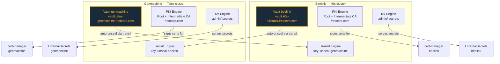
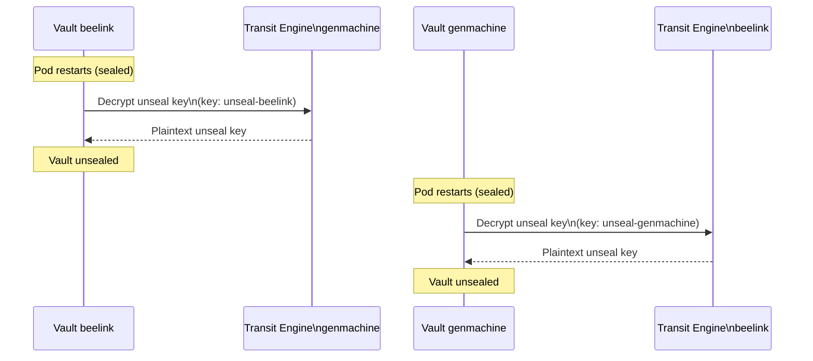
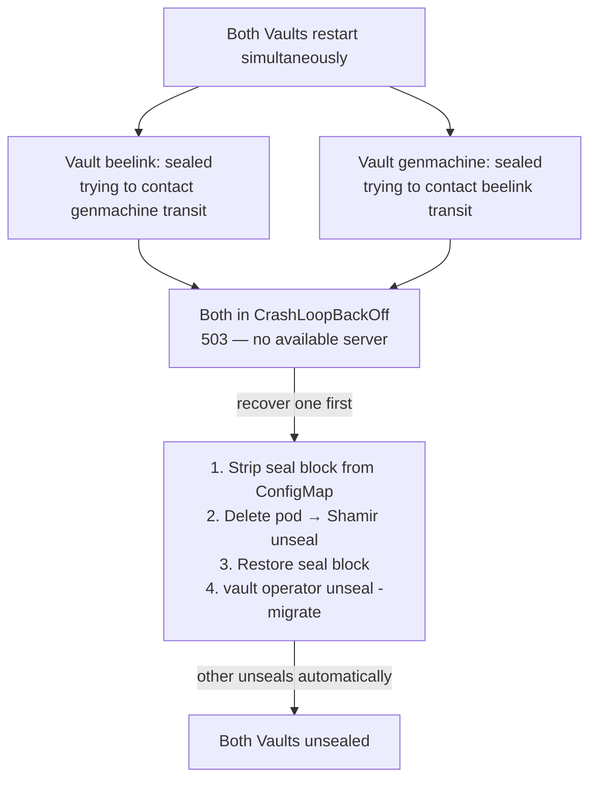
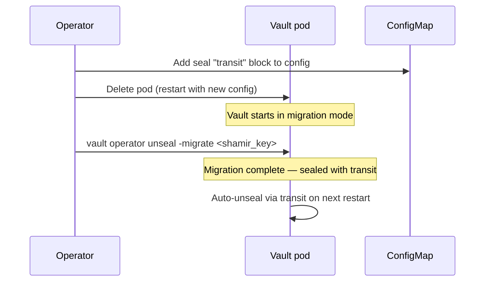
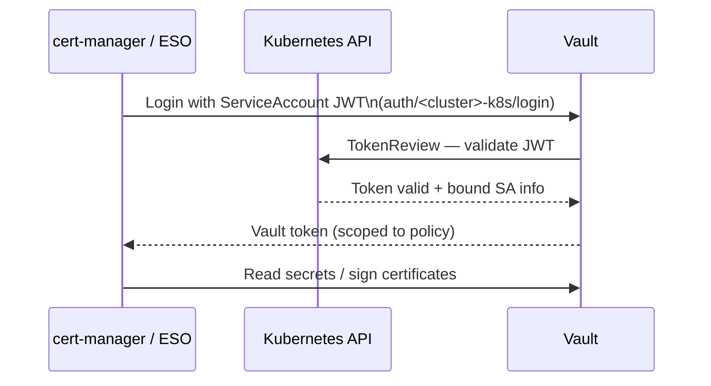

# HashiCorp Vault

## Overview

Two Vault instances are deployed across the two clusters. Each instance serves as both a secrets engine and a PKI certificate authority for its cluster, and as an auto-unseal transit engine for the other cluster.



## Transit Auto-Unseal

Each Vault is configured to use the **other cluster's Transit engine** to automatically unseal on restart. This removes the need for manual Shamir key entry after a pod restart.



### Helm configuration

The transit seal block is injected into the Vault `standalone.config` HCL via a Kubernetes secret:

```yaml
vault:
  server:
    extraSecretEnvironmentVars:
      - envName: TRANSIT_UNSEAL_TOKEN
        secretName: vault-transit-token
        secretKey: token
    standalone:
      enabled: true
      config: |-
        ui = true
        listener "tcp" {
          tls_disable = 1
          address     = "[::]:8200"
        }
        storage "file" {
          path = "/vault/data"
        }
        seal "transit" {
          address         = "https://vault.talos-genmachine.fredcorp.com"
          token           = "$TRANSIT_UNSEAL_TOKEN"
          key_name        = "unseal-beelink"
          mount_path      = "transit/"
          tls_skip_verify = "true"
        }
```

The `vault-transit-token` secret must be created **before** ArgoCD syncs Vault. Use the Taskfile helpers:

```bash
# Create the transit token secret on beelink (reads token from genmachine Vault)
task vault:unseal-secret:beelink

# Create the transit token secret on genmachine (reads token from beelink Vault)
task vault:unseal-secret:genmachine
```

### Circular deadlock recovery

> [!WARNING]
> If both Vaults restart simultaneously, they each try to contact the other's transit engine while both are sealed — causing a crash loop.



Recovery is automated via Taskfile:

```bash
# Recover beelink first (will allow genmachine to auto-unseal)
task vault:break-deadlock:beelink

# Or recover genmachine first
task vault:break-deadlock:genmachine
```

## Seal Migration (Shamir → Transit)

When enabling transit auto-unseal on an existing Vault initialized with Shamir keys, a seal migration is required.



```bash
vault operator unseal -migrate -address=https://vault.k0s-fullstack.fredcorp.com <shamir_key>
```

> [!NOTE]
> The `-migrate` flag is only accepted once — on the first unseal after the transit seal block is loaded. Subsequent restarts auto-unseal without any manual action.

## Authentication Methods

### Kubernetes Auth

Used by cert-manager and ExternalSecrets to authenticate with Vault using their ServiceAccount tokens:



Configure with:

```bash
task vault:eso-auth-setup cluster=genmachine
task vault:certmanager-auth-setup cluster=genmachine
```

### OIDC Auth

Human operators authenticate via Authentik SSO. See the [OIDC documentation](../authentication/oidc.md) for setup details.
